---
## Front matter
lang: ru-RU
title: Операционные системы
subtitle: Установка ОС на виртуальную машину
author:
  - Хрисанова Ксения Олеговна
institute:
  - Российский университет дружбы народов, Москва, Россия
date: 28 февраля 2026

## Formatting pdf
toc: false
slide_level: 2
aspectratio: 169
section-titles: true

---

## Актуальность
- Виртуализация — основа IT-инфраструктуры
- Fedora — популярный дистрибутив Linux
- Sway — современный оконный менеджер
 
 ## Цель работы
Приобретение практических навыков установки ОС на виртуальную машину. 

## Задачи
 1. Создать виртуальную машину 
 2. Установить Fedora Sway
 3. Настроить систему
 4. Проанализировать dmesg

# Процесс выполнения лабораторной работы

## Создание виртуальной машины

Была создана виртуальная машина в VirtualBox с объёмом оперативной памяти 2048 МБ и размером жёсткого диска 80 ГБ (рис. @fig-01).

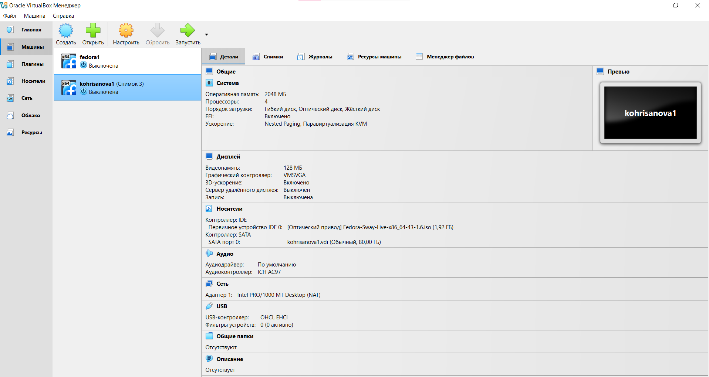{#fig-01 width=70%}

## Установка операционной системы

Запускаю виртуальную машину и выбираю установку системы на жёсткий диск.
 Устанавливаю язык для интерфейса и раскладки клавиатуры (рис. @fig-02).

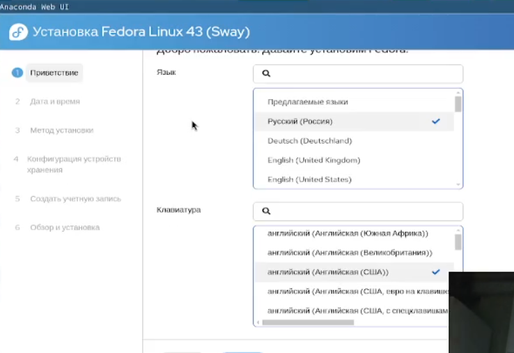{#fig-02 width=70%}

Устанавливаю дату и время(рис. @fig-03)

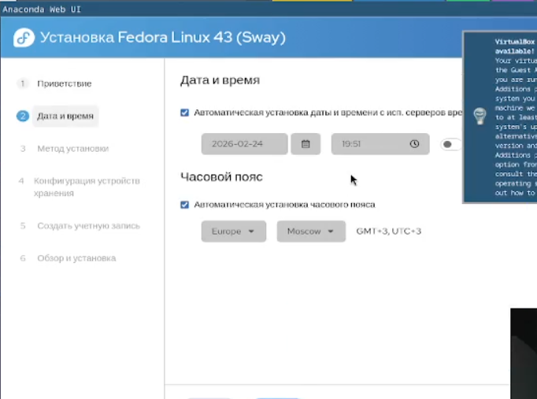{#fig-03 width=70%}

Создаю учетную запись(рис. @fig-04)

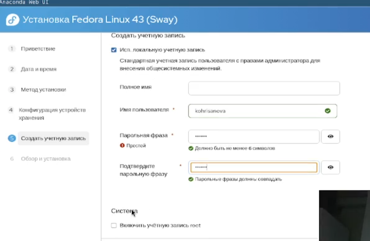{#fid-04 width=70%}

Завершение установки и перезагрузка(рис. @fig-05)

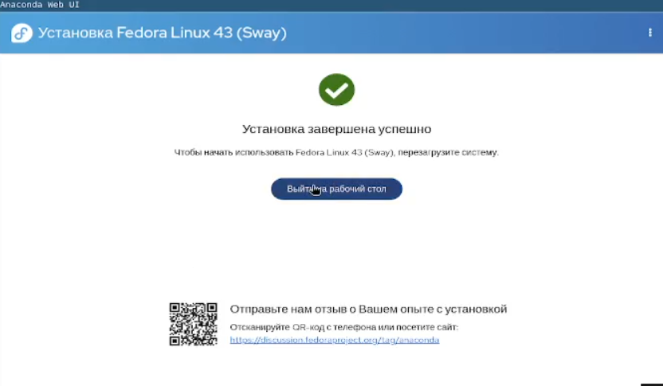{#fig-05 widfh=70%}

## Обновление системы

После установки выполнена установка средств разработки:(рис. @fig-06).

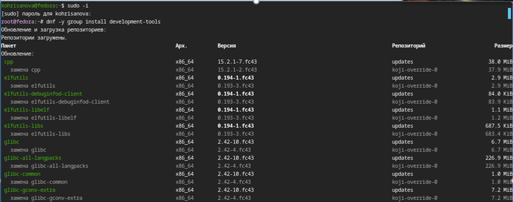{#fig-06 width=70%}

Далее обновлены все пакеты:(рис. @fig-07).

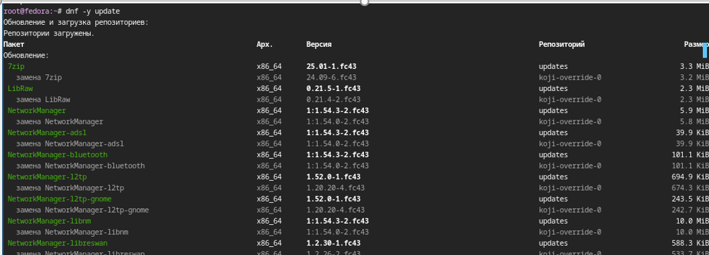{#fig-07 width=70%}

## Повышение комфорта работы
Установлены программы для удобства работы в консоли:(рис. @fig-08).

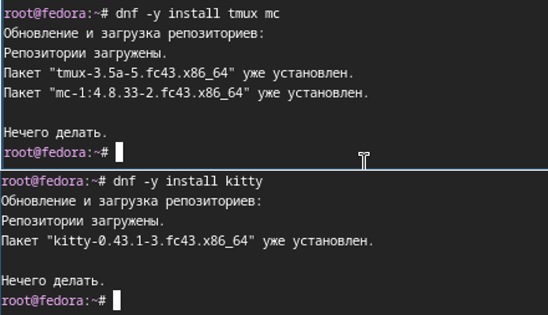{#fig-08 width=70%}

## Отключение SELinux

 Заменено значение SELINUX=enforcing на значение SELINUX=permissive(рис. @fig-09).

 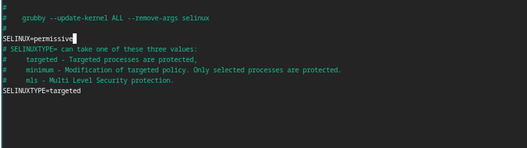{#fig-09 width=70%}

 ## Настройка раскладки клавиатуры

 Отредактирован системный файл конфигурации клавиатуры(рис. @fig-10).

 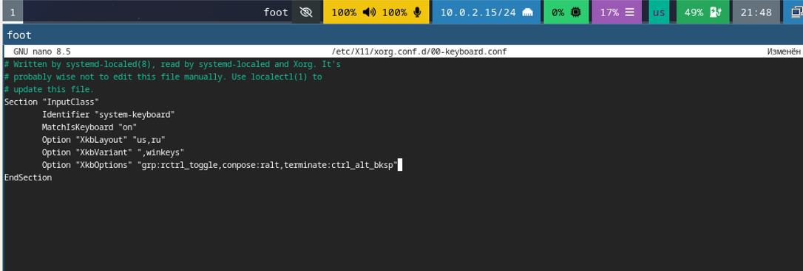{#fig-10 width=70%}

 ## Установка ПО для документации

 Для подготовки отчёта были установлены необходимые программы(рис. @fig-11)(рис. @fig-12).

 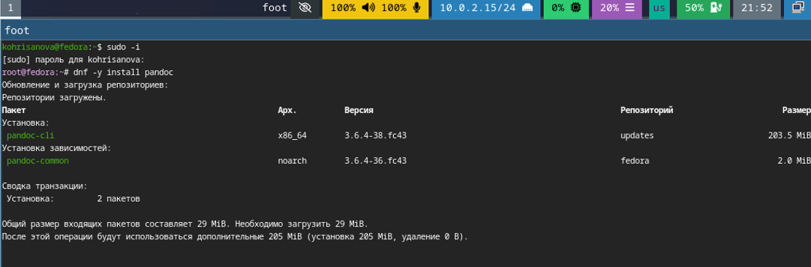{#fig-11 wigth=70%}

 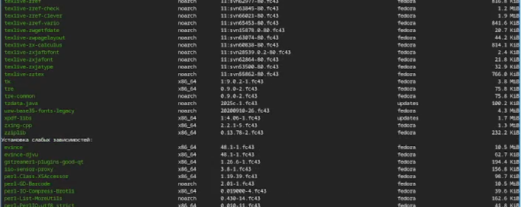{#fig-12 wigth=70%}

 ## Домашнее задание

 Для анализа процесса загрузки системы была использована команда dmesg, которая выводит сообщения ядра Linux.

 №1.Версия ядра Linux(рис. @fig-13).

 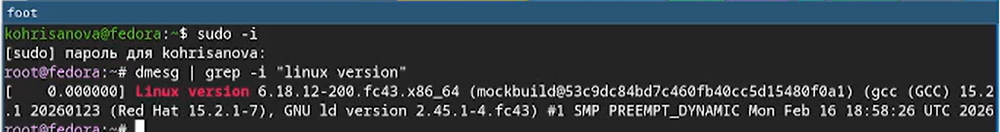{#fig-13 wigth=70%}

№2.Частота процессора(рис. @fig-14).

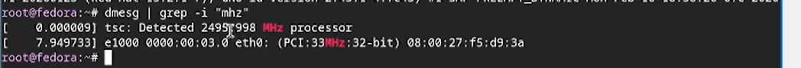{#fig-14 wigth=70%}

№3.Модель процессора(рис. @fig-15).

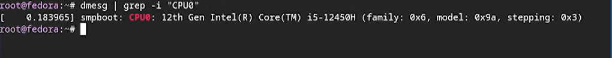{#fig-15 wigth=70%}

№4.Объём доступной оперативной памяти(рис. @fig-16).

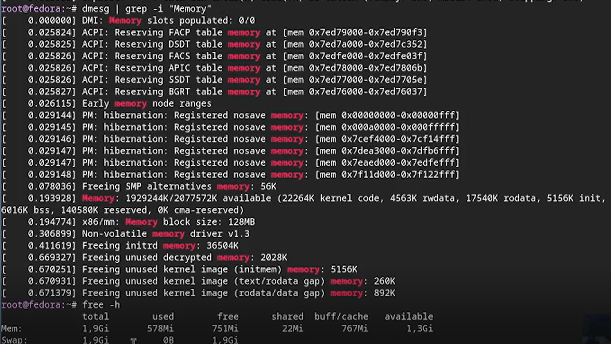{#fig-16 wigth=70%}

№5.Тип обнаруженного гипервизора(рис. @fig-17).

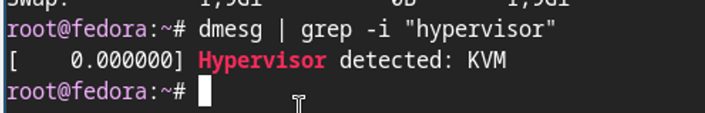{#fig-17 wigth=70%}

№6.Тип файловой системы корневого раздела(рис. @fig-18).

№7.Последовательность монтирования файловых систем(рис. @fig-18).
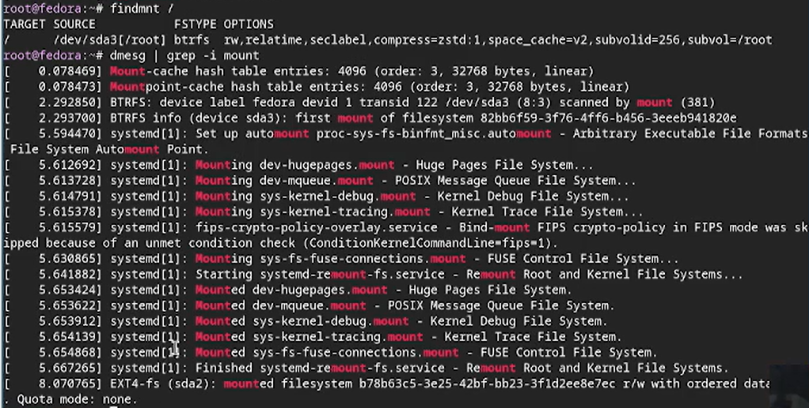{#fig-18 wigth=70%}

## Вывод

Мы приобрели практические навыки установки операционной системы на виртуальную машину, настройки минимально необходимых для дальнейшей работы сервисов.

