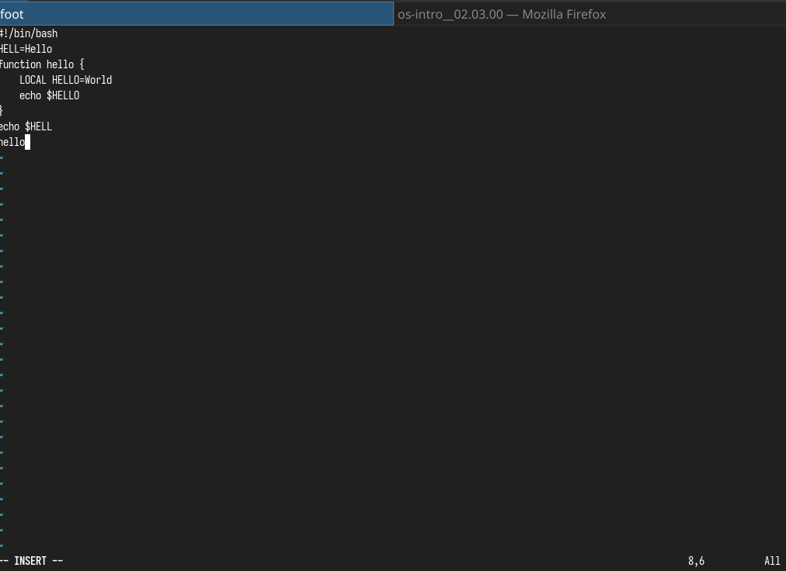
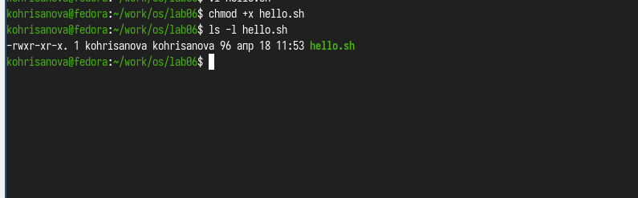
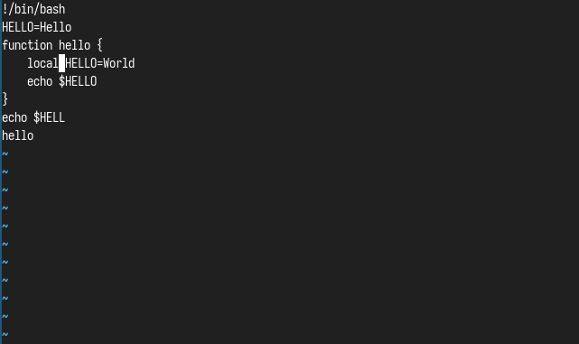
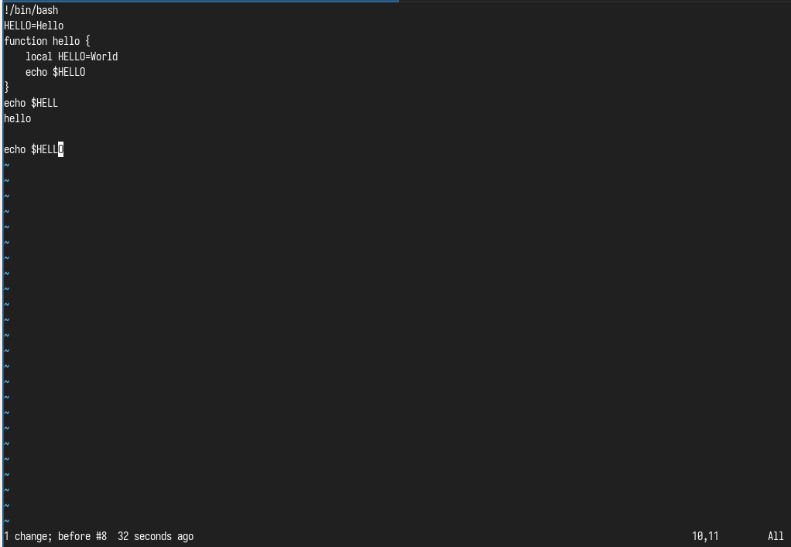
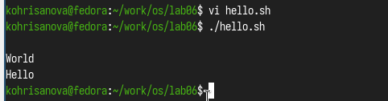

## Цель

Познакомиться с операционной системой Linux. Получить практические навыки рабо- ты с редактором vi, установленным по умолчанию практически во всех дистрибутивах.

## Задание

1. Создайте каталог с именем ~/work/os/lab06.
2. Перейдите во вновь созданный каталог.
3. Вызовите vi и создайте файл hello.sh
4. Нажмите клавишу i и вводите следующий текст.
5. Нажмите клавишу Esc для перехода в командный режим после завершения ввода
текста.
6. Нажмите : для перехода в режим последней строки и внизу вашего экрана появится
приглашение в виде двоеточия.
7. Нажмите w (записать) и q (выйти), а затем нажмите клавишу Enter для сохранения
вашего текста и завершения работы.
8. Сделайте файл исполняемым
Задание 2. Редактирование существующего файла
1. Вызовите vi на редактирование файла
1 vi ~/work/os/lab06/hello.sh
2. Установите курсор в конец слова HELL второй строки.
3. Перейдите в режим вставки и замените на HELLO. Нажмите Esc для возврата в команд-
ный режим.
4. Установите курсор на четвертую строку и сотрите слово LOCAL.
5. Перейдите в режим вставки и наберите следующий текст: local, нажмите Esc для
возврата в командный режим.
6. Установите курсор на последней строке файла. Вставьте после неё строку, содержащую
следующий текст: echo $HELLO.
7. Нажмите Esc для перехода в командный режим.
8. Удалите последнюю строку.
9. Введите команду отмены изменений u для отмены последней команды.
10. Введите символ : для перехода в режим последней строки. Запишите произведённые
изменения и выйдите из vi.

## Выполнение лабораторной работы

### Пишу код из листинга в редакторе. (рис. @fig:001)

{#fig:001 width=70%}

## Делаю файл исполняемым (рис. @fig:002) 

{#fig:002 width=70%}

## Редактирую через vim горячими клавишами программу. (рис. @fig:003) 

{#fig:003 width=70%}

## Редактирую через vim горячими клавишами программу. (рис. @fig:004) 

{#fig:004 width=70%}

## Запускаю написанную программму. (рис. @fig:005)

{#fig:005 width=70%}  

##  Выводы

Мы Познакомились с операционной системой Linux. Получили практические навыки работы с редактором vi, установленным по умолчанию практически во всех дистрибутивах.

