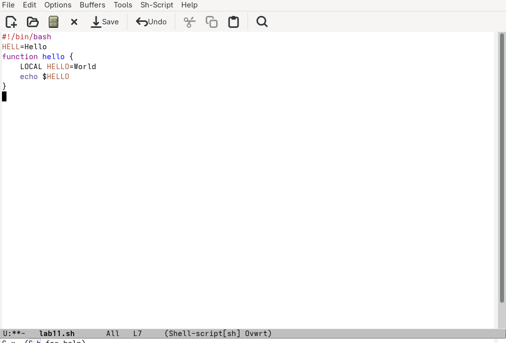
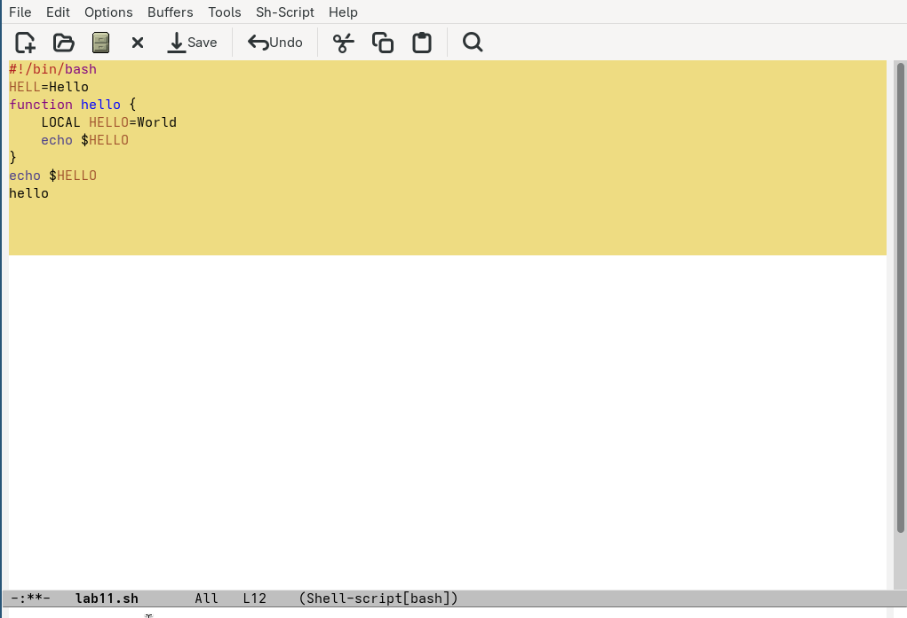
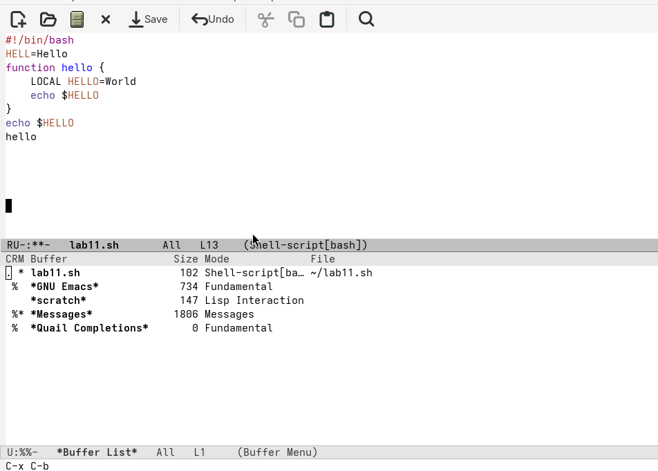
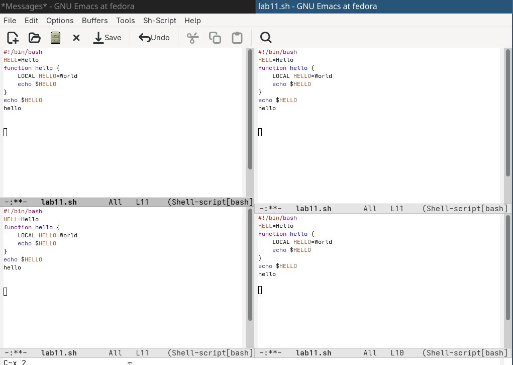

## Цель 

Познакомиться с операционной системой Linux. Получить практические навыки рабо-
ты с редактором Emacs.

## Задание

1. Открыть emacs.
2. Создать файл lab07.sh с помощью комбинации Ctrl-x Ctrl-f (C-x C-f).
3. Наберите текст
4. Сохранить файл с помощью комбинации Ctrl-x Ctrl-s (C-x C-s).
5. Проделать с текстом стандартные процедуры редактирования, каждое действие долж-
но осуществляться комбинацией клавиш.
7. Управление буферами.
8. Управление окнами.
9. Режим поиска

## Выполнение лабораторной работы

### Через emacs пишу код.

{#fig:001 width=70%}

## Через горячие клавиши редактирую программу. (рис. @fig:002)

{#fig:002 width=70%}

## Перемещаю открытое окно Ctrl-x со списком открытых буферов и переключаюсь на другой буфер.(рис. @fig:004)

{#fig:004 width=70%}

## Открываю 4 фрейма, пользуюсь поиском с заменой и поиском по регулярным выражениям. (рис. @fig:005)

{#fig:005 width=70%}

##  Вывод

Мы Познакомились с операционной системой Linux. Получили практические навыки работы с редактором Emacs.
