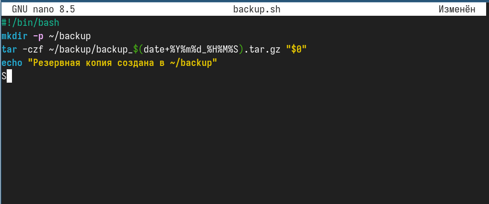
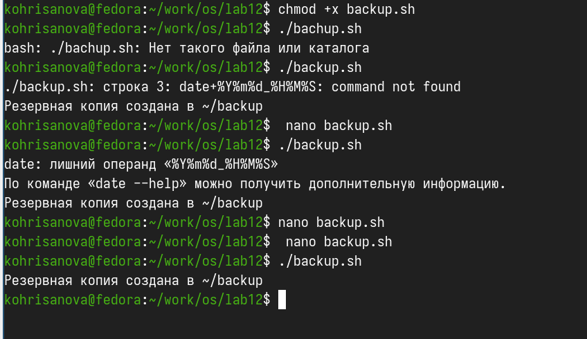
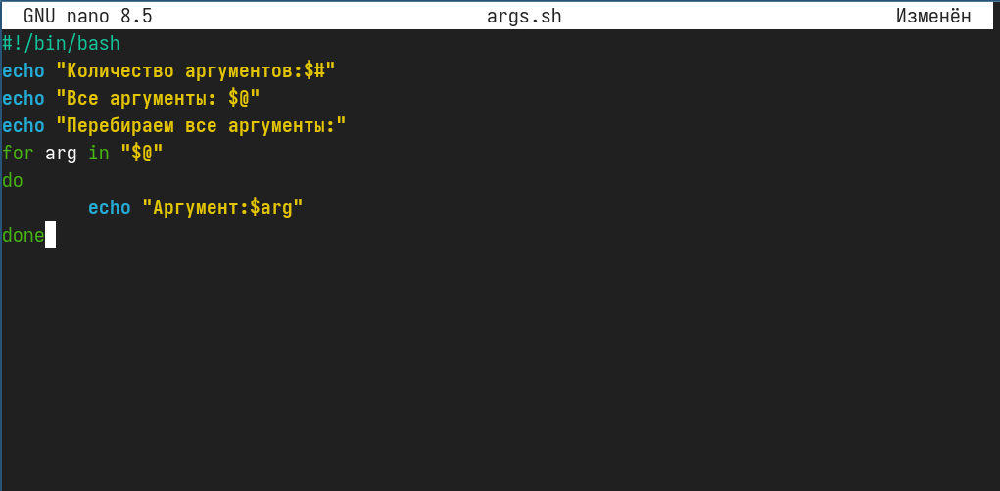
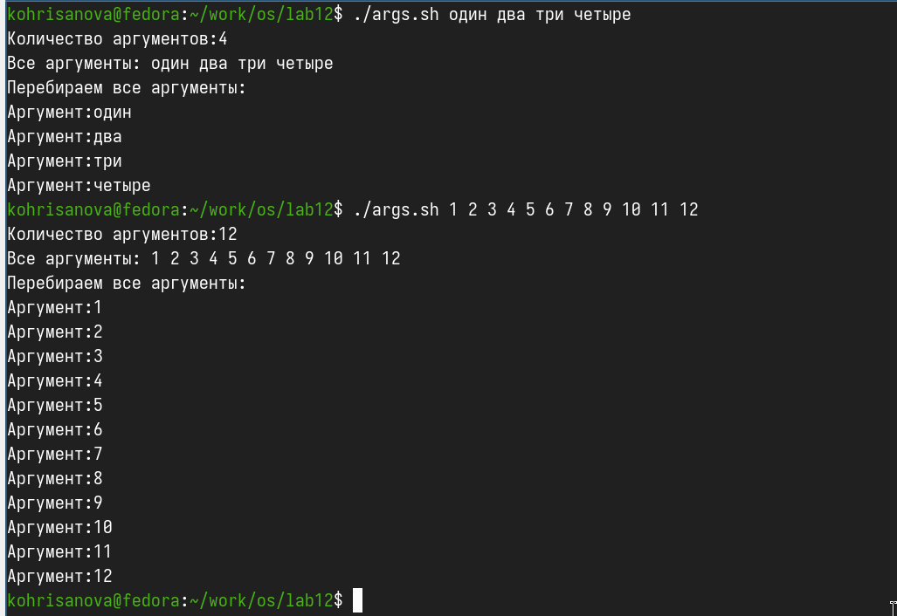
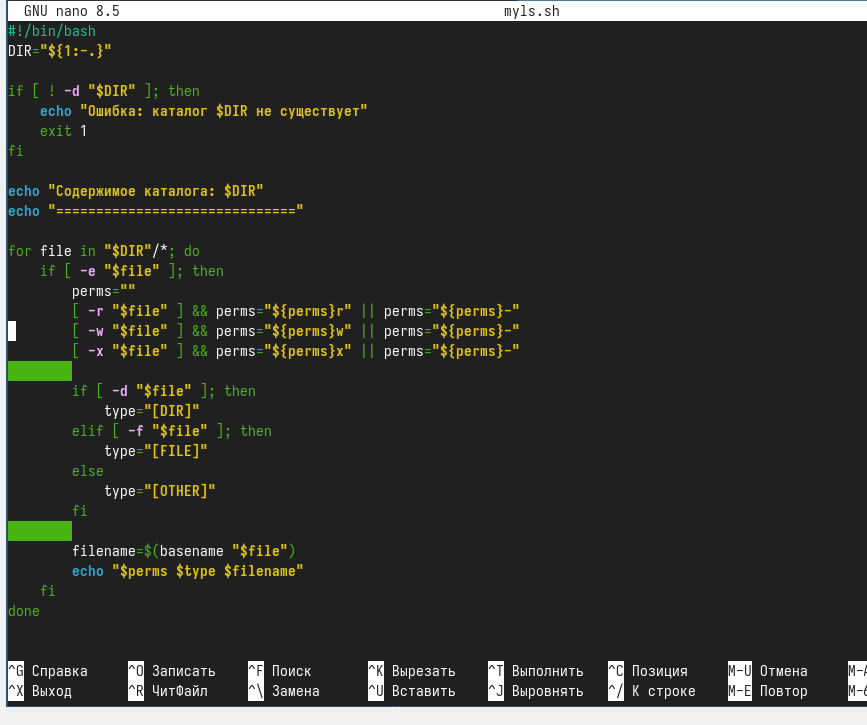
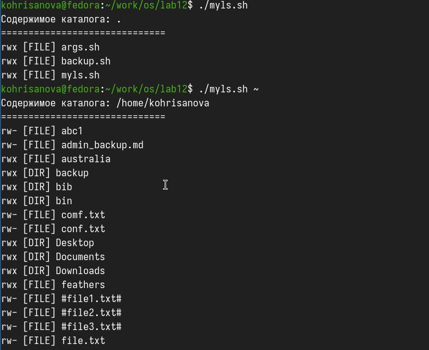
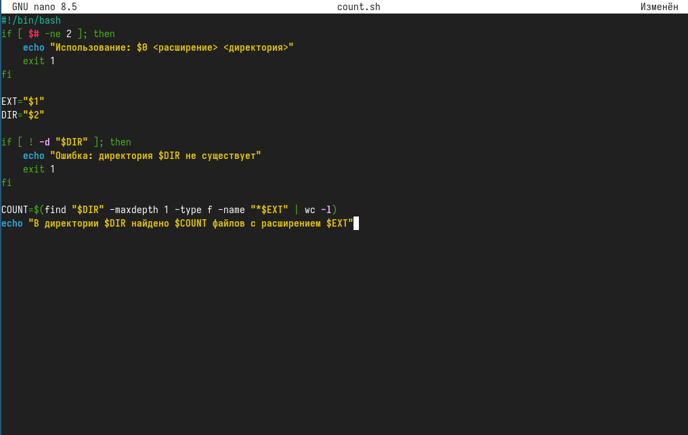
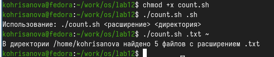

---
## Front matter
title: "Отчёт по лабораторной работе №12"
subtitle: "Программирование в командном процессоре ОС UNIX. Командные файлы"
author: "Хрисанова Ксения Олеговна"

## Generic otions
lang: ru-RU
toc-title: "Содержание"

## Pdf output format
toc: true # Table of contents
toc-depth: 2
lof: true # List of figures
lot: true # List of tables
fontsize: 12pt
linestretch: 1.5
papersize: a4
documentclass: scrreprt
## I18n polyglossia
polyglossia-lang:
  name: russian
  options:
    - spelling=modern
    - babelshorthands=true
polyglossia-otherlangs:
  name: english
## I18n babel
babel-lang: russian
babel-otherlangs: english
## Fonts
mainfont: "Liberation Serif"
sansfont: "Liberation Sans"
monofont: "Liberation Mono"
mathfont: "Liberation Serif"
## Pandoc-crossref LaTeX customization
figureTitle: "Рис."
tableTitle: "Таблица"
listingTitle: "Листинг"
lofTitle: "Список иллюстраций"
lotTitle: "Список таблиц"
lolTitle: "Листинги"
## Misc options
indent: true
header-includes:
  - \usepackage{indentfirst}
  - \usepackage{float} # keep figures where there are in the text
  - \floatplacement{figure}{H} # keep figures where there are in the text

---
# Цель 

Изучить основы программирования в оболочке ОС UNIX/Linux. Научиться писать небольшие командные файлы.

# Задание

1. Написать скрипт, который при запуске будет делать резервную копию самого себя (то есть файла, в котором содержится его исходный код) в другую директорию backup в вашем домашнем каталоге. При этом файл должен архивироваться одним из архиваторов на выбор zip, bzip2 или tar. Способ использования команд архивации необходимо узнать, изучив справку.
2. Написать пример командного файла, обрабатывающего любое произвольное число аргументов командной строки, в том числе превышающее десять. Например, скрипт может последовательно распечатывать значения всех переданных аргументов.
3. Написать командный файл — аналог команды ls (без использования самой этой команды и команды dir). Требуется, чтобы он выдавал информацию о нужном каталоге и выводил информацию о возможностях доступа к файлам этого каталога.
4. Написать командный файл, который получает в качестве аргумента командной строки формат файла (.txt, .doc, .jpg, .pdf и т.д.) и вычисляет количество таких файлов в указанной директории. Путь к директории также передаётся в виде аргумента командной строки.

# Теоретическое введение

Командный процессор (командная оболочка, интерпретатор команд shell) — это программа, позволяющая пользователю взаимодействовать с операционной системой компьютера. В операционных системах типа UNIX/Linux наиболее часто используются следующие реализации командных оболочек: 
– оболочка Борна (Bourne shell или sh) — стандартная командная оболочка UNIX/Linux, содержащая базовый, но при этом полный набор функций;
– С-оболочка (или csh) — надстройка на оболочкой Борна, использующая С-подобный синтаксис команд с возможностью сохранения истории выполнения команд; 
– оболочка Корна (или ksh) — напоминает оболочку С, но операторы управления программой совместимы с операторами оболочки Борна; 
– BASH — сокращение от Bourne Again Shell (опять оболочка Борна), в основе своей совмещает свойства оболочек С и Корна (разработка компании Free Software Foundation). POSIX (Portable Operating System Interface for Computer Environments) — набор стандартов описания интерфейсов взаимодействия операционной системы и прикладных программ. Стандарты POSIX разработаны комитетом IEEE (Institute of Electrical and Electronics Engineers) для обеспечения совместимости различных UNIX/Linux-подобных операционных систем и переносимости прикладных программ на уровне исходного кода. POSIX-совместимые оболочки разработаны на базе оболочки Корна.

# Выполнение лабораторной работы

Написала скрипт, который создаёт резервную копию самого себя(рис. @fig:001)

{#fig:001 width=70%}

Сделала файл исполняемым и запустила скрипт(рис. @fig:002)

{#fig:002 width=70%}

Написала скрипт, обрабатывающий произвольное количество аргументов, в том числе больше десяти(рис. @fig:003)

{#fig:003 width=70%}

Сделала файл исполняемым и запустила скрипт с 4 аргументами и с 12 аргументами(рис. @fig:004)

{#fig:004 width=70%}

Написала аналог команды ls без использования самой ls и dir(рис. @fig:005)

{#fig:005 width=70%}

Запускаю скрипт без аргументов, а потом передаю ему путь к домашнему каталогу(рис. @fig:006)

{#fig:006 width=70%}

Написала скрипт, который подсчитывает количество файлов с заданным расширением в указанной директории(рис. @fig:007)

{#fig:007 width=70%}

Запускаю скрипт — считаю количество .sh файлов в текущей директории и читаю количество .txt файлов в домашней директории(рис. @fig:008)

{#fig:008 width=70%}

# Выводы

В данной работе мы изучили основы программирования в оболочке ОС UNIX/Linux. Научились писать небольшие командные файлы и скрипты на языке bush.

# Контрольные вопросы

1. Объясните понятие командной оболочки. Приведите примеры командных оболочек. Чем они отличаются?
Ответ: 
a)	sh — стандартная командная оболочка UNIX/Linux, содержащая базовый, 	полный набор функций
b)	csh — использующая С-подобный синтаксис команд с возможностью 	сохранения истории выполнения команд
c)	ksh — напоминает оболочку С, но операторы управления программой 	совместимы с операторами оболочки Борна
d)	bash — сокращение от Bourne Again Shell (опять оболочка Борна), в основе 	своей совмещает свойства оболочек С и Корна

2. Что такое POSIX?
Ответ: POSIX (Portable Operating System Interface for Computer Environments) — набор  стандартов описания интерфейсов взаимодействия операционной системы и прикладных программ.

3. Как определяются переменные и массивы в языке программирования bash?
Ответ: Переменные вызываются $var, где var=чему-то, указанному пользователем, неважно что бы то не было, название файла, каталога или еще чего.
Для массивов используется команда set -A

4. Каково назначение операторов let и read?
Ответ: let — вычисляет далее заданное математическое значение
read — позволяет читать значения переменных со стандартного ввода

5. Какие арифметические операции можно применять в языке программирования bash?
Ответ: Прибавление, умножение, вычисление, 	деление), сравнение значений, экспонирование и др.

6. Что означает операция (( ))?
Ответ: Это обозначение используется для облегчения программирования для условий bash 

7. Какие стандартные имена переменных Вам известны?
Ответ: Нам известны HOME, PATH, BASH, ENV, PWD, UID, OLDPWD, PPID, GROUPS, OSTYPE, PS1 - PS4, LANG, HOSTFILE, MAIL, TERM, LOGNAME, USERNAME, IFS и др.

8. Что такое метасимволы?
Ответ: Метасимволы это специальные знаки, которые могут использоваться для сокращения пути, 	поиска объекта по расширению, перед переменными, например «$» или «*» .

9. Как экранировать метасимволы?
Ответ: Добавить перед метасимволом метасимвол «\»

10. Как создавать и запускать командные файлы?
Ответ: При помощи команды chmod. Надо дать права на запуск chmod +x название файла, затем запустить bash  ./название файла
Например у нас файл lab
Пишем: 
chmod +x lab
./lab

11. Как определяются функции в языке программирования bash?
Ответ: Объединяя несколько команд с помощью function

12 Каким образом можно выяснить, является файл каталогом или обычным файлом?
Ответ: Можно задать команду на проверку диретория ли это test -d директория

13 Каково назначение команд set, typeset и unset?
Ответ: 
Set — используется для создания массивов
Unset — используется для изъятия переменной
Typeset — используется для присваивания каких-либо функций

14. Как передаются параметры в командные файлы?
Ответ: Добавлением аршументов после команды запуска bash скрипта

15. Назовите специальные переменные языка bash и их назначение.
Ответ: 
```
–	$* — отображается вся командная строка или параметры оболочки;
–	$? — код завершения последней выполненной команды;
–	$$ — уникальный идентификатор процесса, в рамках которого выполняется командный процессор;
–	$! — номер процесса, в рамках которого выполняется последняя вызванная на выполнение в командном режиме команда;
–	$- — значение флагов командного процессора;
–	${#*} — возвращает целое число — количество слов, которые были результатом
$*;
–	${#name} — возвращает целое значение длины строки в переменной name;
–	${name[n]} — обращение к n-му элементу массива;
–	${name[*]} — перечисляет все элементы массива, разделённые пробелом;
–	${name[@]} — то же самое, но позволяет учитывать символы пробелы в самих переменных;
–	${name:-value}—еслизначениепеременнойnameнеопределено,тоонобудет заменено на указанное value;
–	${name:value} — проверяется факт существования переменной;
–	${name=value} — если name не определено, то ему присваивается значение value;
–	${name?value} — останавливает выполнение, если имя переменной не определено, и выводит value как сообщение об ошибке;
–	${name+value} — это выражение работает противоположно ${name-value}. Если переменная определена, то подставляется value;
–	${name#pattern} — представляет значение переменной name с удалённым самым коротким левым образцом (pattern);
–	${#name[*]}и${#name[@]}—этивыражениявозвращаютколичествоэлементов в массиве name.
```