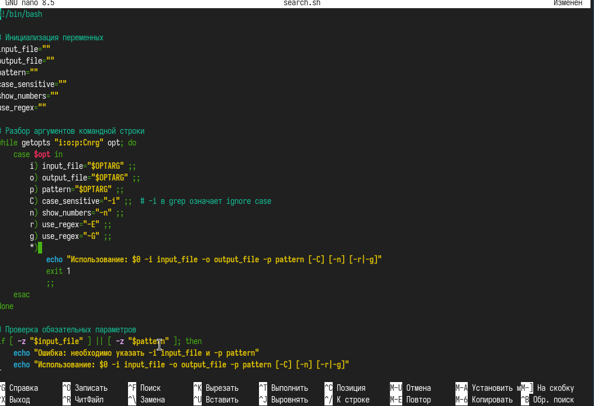
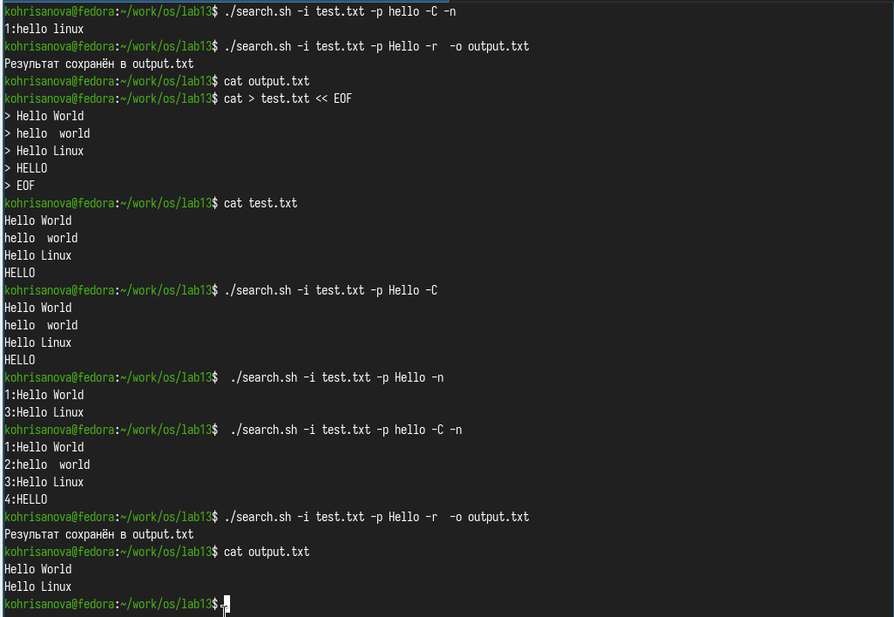
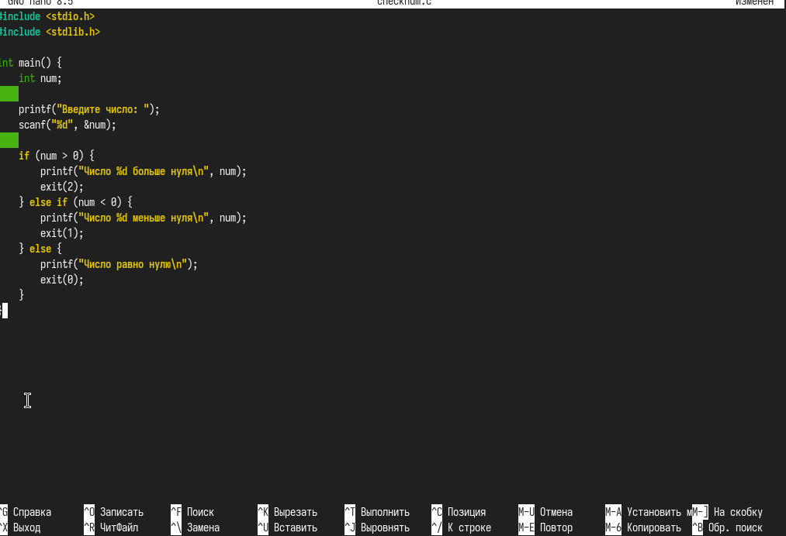
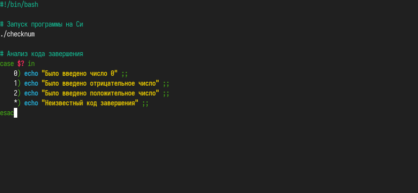
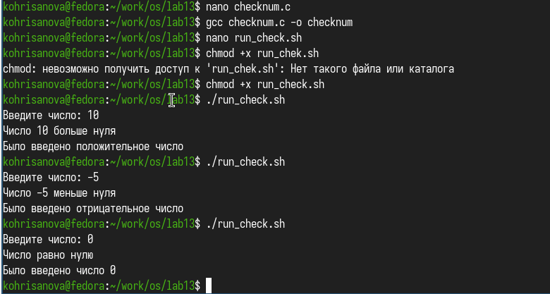
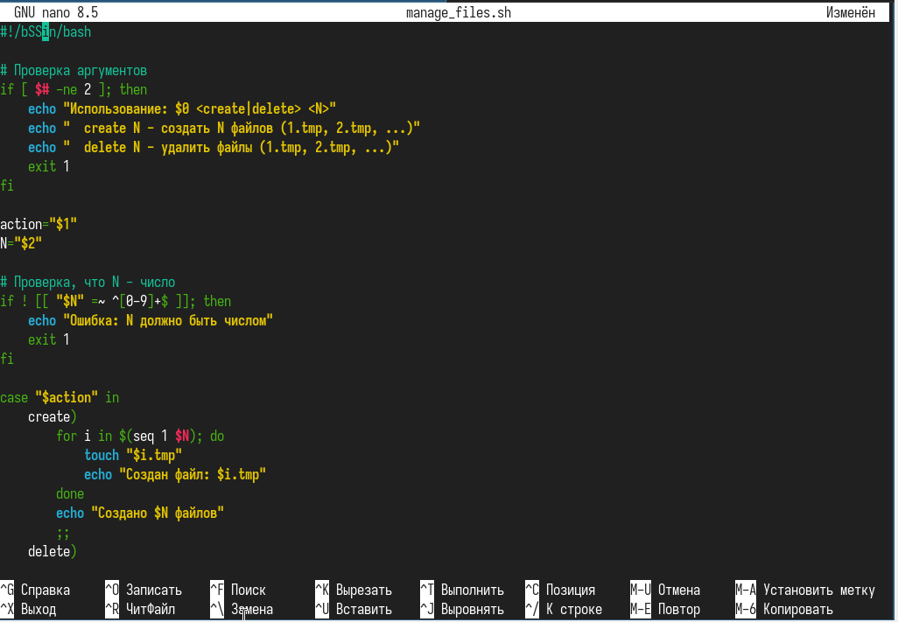
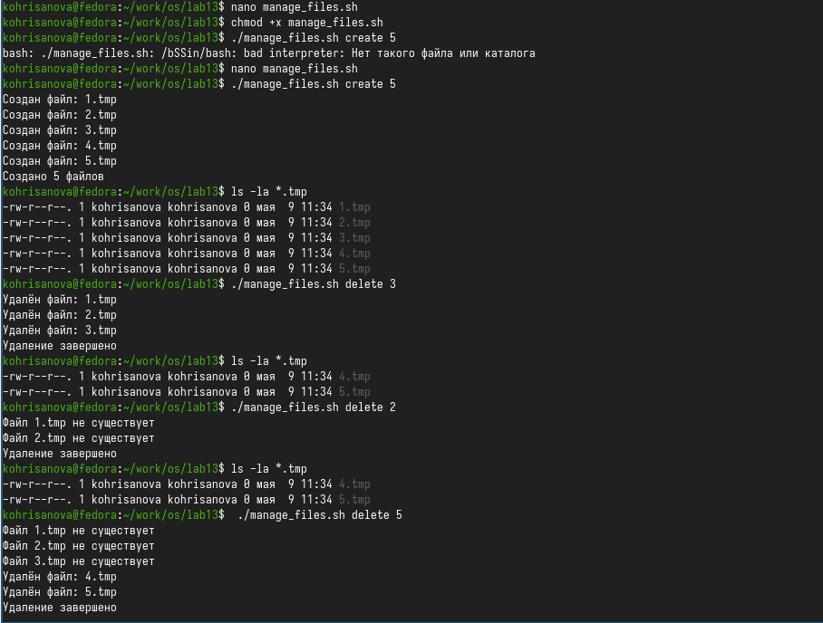
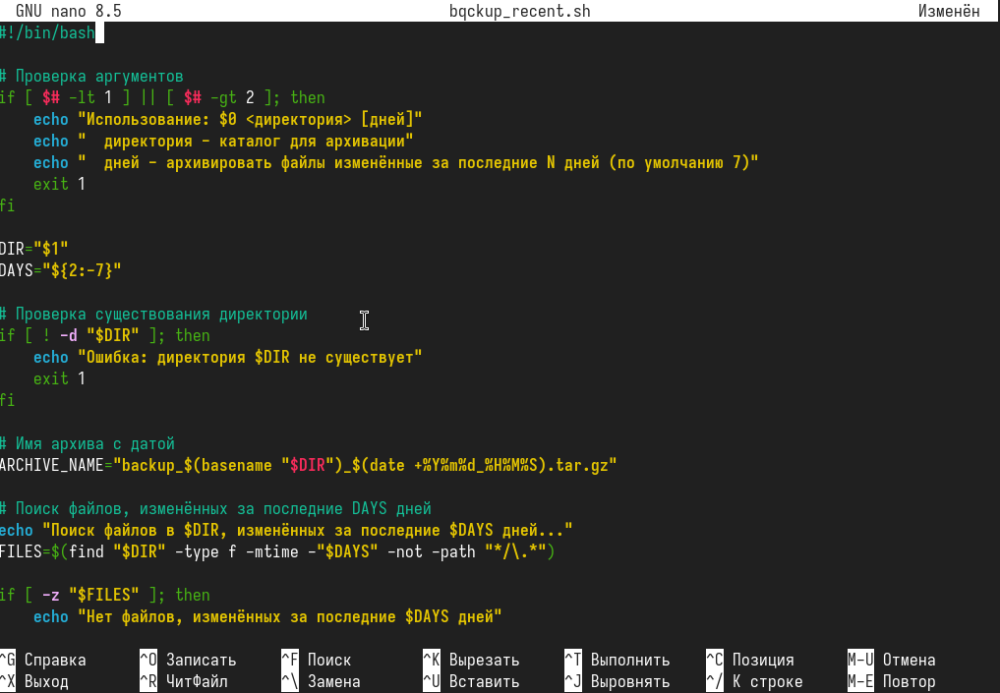
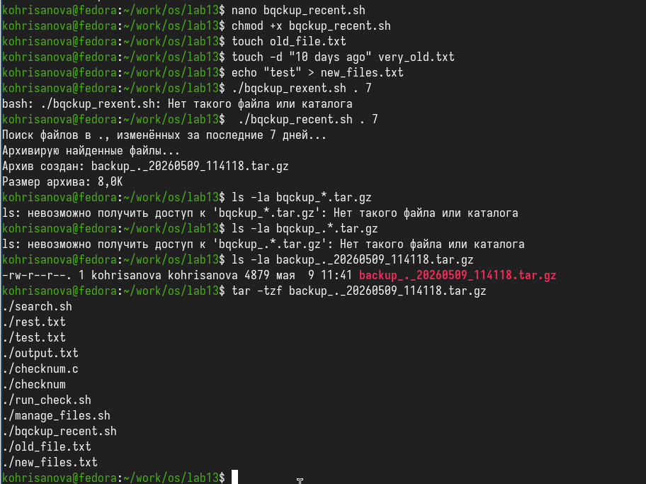

## Цель

Изучить основы программирования в оболочке ОС UNIX. Научится писать более сложные командные файлы с использованием логических управляющих конструкций и циклов.

## Задачи

Используя команды getopts grep, написать командный файл, который анализирует командную строку с ключами: – -iinputfile — прочитать данные из указанного файла; – -ooutputfile — вывести данные в указанный файл; – -pшаблон — указать шаблон для поиска; – -C — различать большие и малые буквы; – -n — выдавать номера строк. а затем ищет в указанном файле нужные строки, определяемые ключом -p.
Написать на языке Си программу, которая вводит число и определяет, является ли оно больше нуля, меньше нуля или равно нулю. Затем программа завершается с помощью функции exit(n), передавая информацию в о коде завершения в оболочку. Команд- ный файл должен вызывать эту программу и, проанализировав с помощью команды $?, выдать сообщение о том, какое число было введено.
Написать командный файл, создающий указанное число файлов, пронумерованных последовательно от 1 до 𝑁 (например 1.tmp, 2.tmp, 3.tmp,4.tmp и т.д.). Число файлов, которые необходимо создать, передаётся в аргументы командной строки. Этот же ко- мандный файл должен уметь удалять все созданные им файлы (если они существуют).
Написать командный файл, который с помощью команды tar запаковывает в архив все файлы в указанной директории. Модифицировать его так, чтобы запаковывались только те файлы, которые были изменены менее недели тому назад (использовать команду find).

## Выполнение лабораторной работы

### Пишу скрипт с getopts для анализа ключей командной строки

{#fig:001 width=70%}

## Делаю файл исполняемым,создаю тестовый файл для проверки,тестирую поиск с разными ключами

{#fig:002 width=70%}

## Пишу программу на Си, которая определяет знак числа и возвращает код завершения

{#fig:003 width=70%}

## Пишу скрипт: запускаю программу, затем через case анализирую код возврата и вывожу сообщение

{#fig:004 width=70%}

## Запускаю и тестирую с разными числами,ввожу положительное число,потом отрицательное,а потом 0

{#fig:005 width=70%}

## Пишу скрипт для создания и удаления нумерованных файлов

{#fig:006 width=70%}

## Создаю 5 файлов,удаляю все файлы\

{#fig:007 width=70%}

## Пишу скрипт для архивации файлов, изменённых за последние N дней

{#fig:008 width=70%}

## Создаю тестовые файлы разной давности,запускаю архивацию файлов за последние 7 дней

{#fig:009 width=70%}

## Вывод

Мы изучили основы программирования в оболочке ОС UNIX. Научились писать более сложные командные файлы с использованием логических управляющих конструкций и циклов.