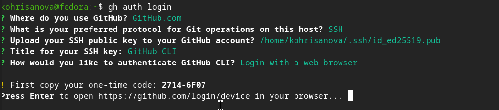
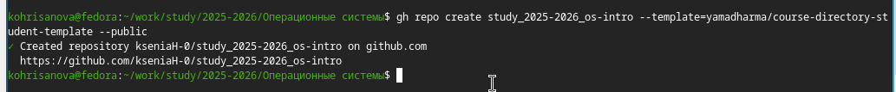

## Цель работы 
Изучить идеологию и применение средств контроля версий. Освоить умения по работе с git.

## Задание
1. Создать базовую конфигурацию для работы с git.
2. Создать ключи SSH и PGP.
3. Настроить подписи коммитов.
4. Зарегистрироваться на GitHub.
5. Создать локальный каталог для выполнения заданий по предмету.

## Теоретическое введение

Системы контроля версий (VCS) позволяют отслеживать изменения в файлах, работать над проектами совместно и возвращаться к предыдущим версиям. Git — распределённая система контроля версий, которая хранит историю изменений локально и может синхронизироваться с удалёнными репозиториями.

Основные команды Git:
- `git init` — инициализация репозитория
- `git add` — добавление файлов в индекс
- `git commit` — сохранение изменений
- `git push` — отправка изменений на сервер
- `git pull` — получение изменений с сервера

## Выполнение лабораторной работы

### Установка и настройка Git

{#fig-01 width=70%}
{#fig-02 width=70%}

## Создние ключей

{#fig-03 width=50%}
{#fig-04 width=70%}

## Добавиление ключей в настройках GitHub

{#fig-05 width=70%}
{#fig-06 width=70%}

## Настройка и авторизация

{#fig-07 width=70%}
{#fig-08 width=70%}

## Создание структуры и каталогов

{#fig-09 width=70%}
{#fig-10 width=70%}

## Настройка рабочей директории

{#fig-11 width=70%}
{#fig-12 width=70%}
{#fig-13 width=70%}

## Вывод

В ходе выполнения лабораторной работы были изучены основные принципы работы систем контроля версий и получены практические навыки работы с Git. Выполнена базовая настройка Git, созданы SSH и PGP ключи, добавлены в настройки GitHub, настроена подпись коммитов. Освоена работа с GitHub CLI, создан репозиторий из шаблона и подготовлена структура каталогов. Цель работы достигнута.
