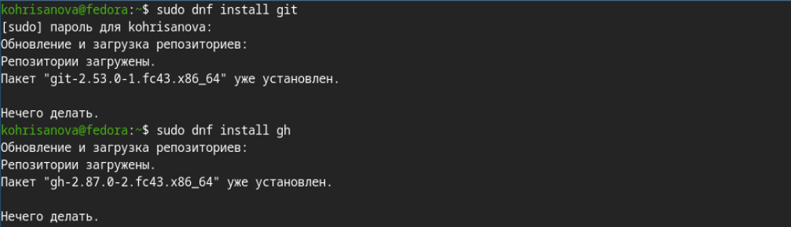
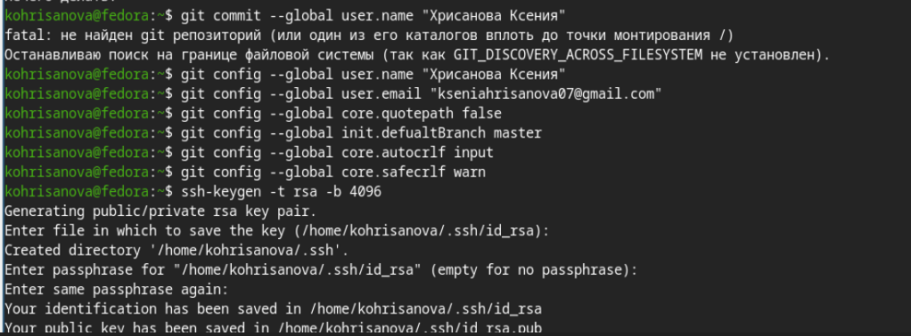
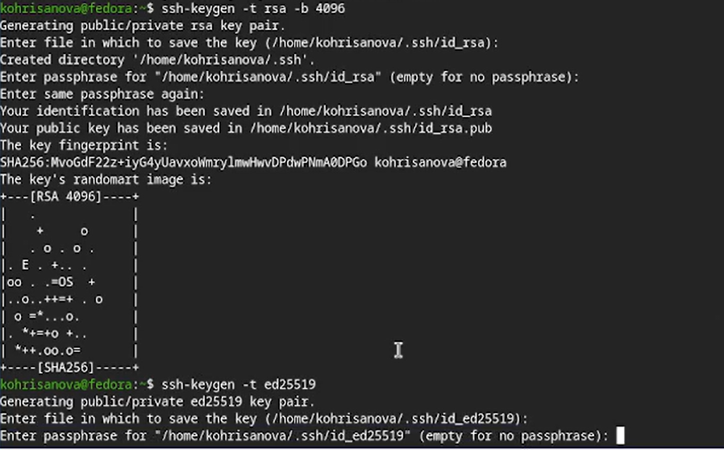
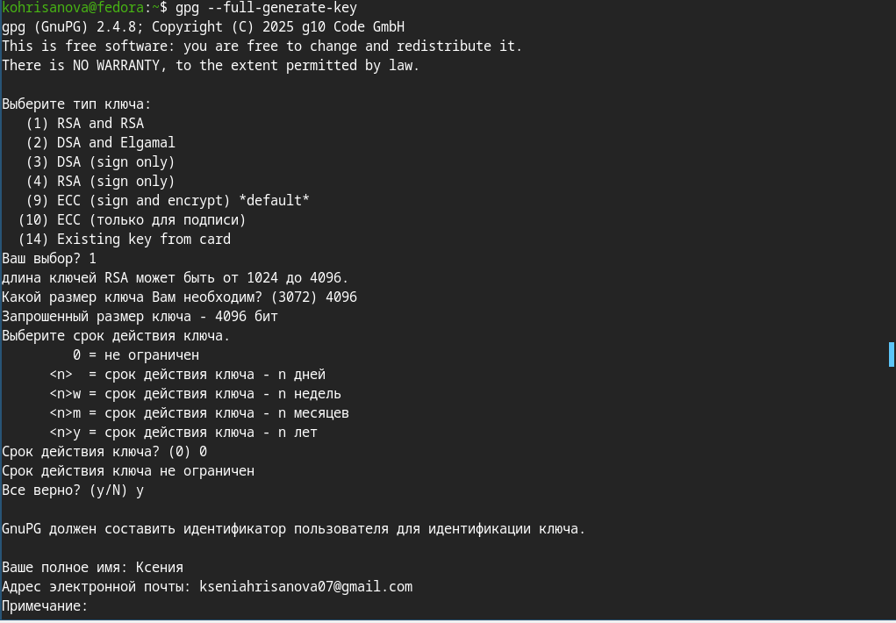
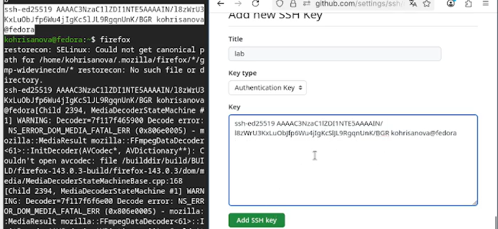
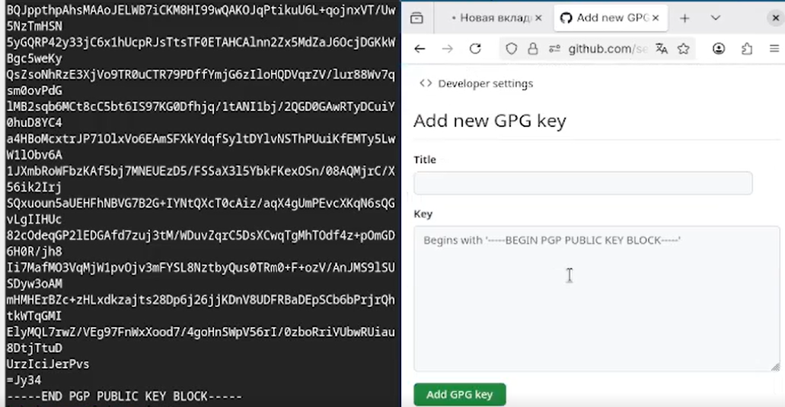
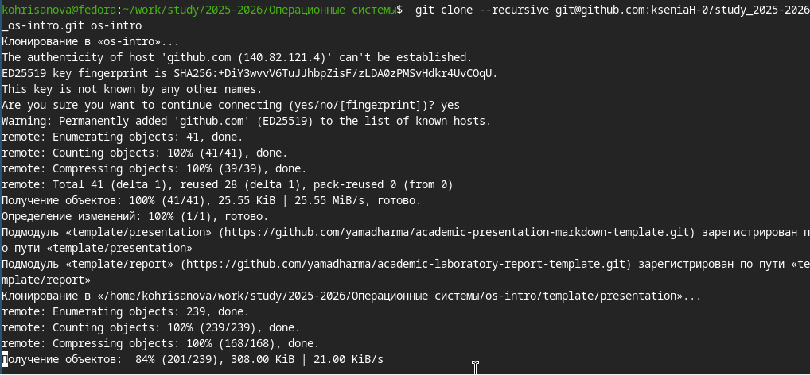
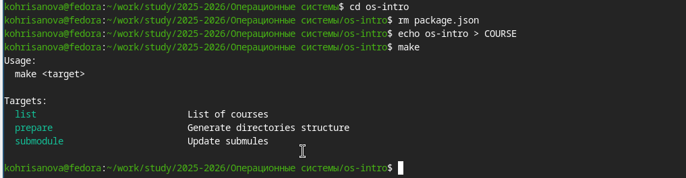
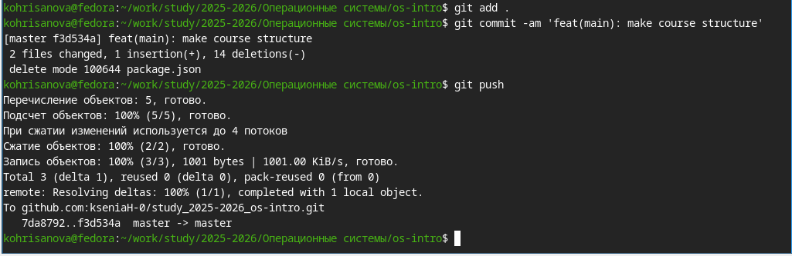

## Цель работы 
Изучить идеологию и применение средств контроля версий. Освоить умения по работе с git.

## Задание
1. Создать базовую конфигурацию для работы с git.
2. Создать ключи SSH и PGP.
3. Настроить подписи коммитов.
4. Зарегистрироваться на GitHub.
5. Создать локальный каталог для выполнения заданий по предмету.

## Теоретическое введение

Системы контроля версий (VCS) позволяют отслеживать изменения в файлах, работать над проектами совместно и возвращаться к предыдущим версиям. Git — распределённая система контроля версий, которая хранит историю изменений локально и может синхронизироваться с удалёнными репозиториями.

Основные команды Git:
- `git init` — инициализация репозитория
- `git add` — добавление файлов в индекс
- `git commit` — сохранение изменений
- `git push` — отправка изменений на сервер
- `git pull` — получение изменений с сервера

## Выполнение лабораторной работы

На первом шаге нужно было выполнить установку Git,но как оказалось он у меня уже установлен.(рис. @fig-01)

{#fig-01 width=70%}

Произвожу базовую настройку git. (рис. @fig-02)

{#fig-02 width=70%}

Создаю SSH ключи (рис. @fig-03)

{#fig-03 width=70%}

Создаю PGP ключ(рис. @fig-04)

{#fig-04 width=70%}

После создания ключа я скопировала его и добавила в настройках GitHub (рис. @fig-05).

{#fig-05 width=70%}

 Экспортировала PGP-ключ и добавила на GitHub(рис. @fig-06)

 {#fig-06 width=70%}

 Настраиваю автоматические подписи для коммитов. (рис. @fig-07)

 {#fig-07 width=70%}

 Авторизуюсь на github для работы через терминал. (рис. @fig-08)

 {#fig-08 width=70%}

 Cоздаю структуру каталогов(рис. @fig-09)

{#fig-09 width=70%}

Создаю репозиторий на GitHub из шаблона(рис. @fig-10)

{#fig-10 width=70%}

Клонирую репозиторий(рис. @fig-11)

{#fig-11 width=70%}

Настраиваю рабочую директорию (рис. @fig-12)

{#fig-12 width=70%}

Отправляю изменения на GitHub(рис. @fig-13)

{#fig-13 width=70%}

## Вывод

В ходе выполнения лабораторной работы были изучены основные принципы работы систем контроля версий и получены практические навыки работы с Git. Выполнена базовая настройка Git, созданы SSH и PGP ключи, добавлены в настройки GitHub, настроена подпись коммитов. Освоена работа с GitHub CLI, создан репозиторий из шаблона и подготовлена структура каталогов. Цель работы достигнута.

## Контрольные вопросы

Ты права, я случайно изменил формулировки вопросов. Вот **оригинальные вопросы** из твоего файла и **готовые ответы** (которые можно сразу копировать) — я ничего в вопросах не менял.

---

## Контрольные вопросы (оригинальные формулировки)

**1. Что такое системы контроля версий (VCS) и для решения каких задач они предназначаются?**

Системы контроля версий — это программные инструменты, которые помогают организовать совместную работу над проектами. Они хранят историю изменений файлов, позволяют отслеживать, кто и когда внёс правки, дают возможность возвращаться к предыдущим версиям, а также объединять изменения от разных участников. Основная задача VCS — обеспечить порядок и контроль при разработке, особенно когда над проектом работает несколько человек.

---

**2. Объясните следующие понятия VCS и их отношения: хранилище, commit, история, рабочая копия.**

Хранилище — это место (локальное или удалённое), где хранятся все файлы проекта и история их изменений. Коммит — это зафиксированное состояние проекта в определённый момент времени, своего рода снимок того, как выглядят файлы после внесённых правок. История — это последовательность коммитов, которая позволяет проследить развитие проекта, увидеть, какие изменения вносились и кем. Рабочая копия — это текущая версия файлов проекта на компьютере разработчика, с которой он непосредственно работает; она может отличаться от последнего коммита, если изменения ещё не зафиксированы.

---

**3. Что представляют собой и чем отличаются централизованные и децентрализованные VCS? Приведите примеры VCS каждого вида.**

Централизованные системы контроля версий работают по принципу «клиент-сервер»: все файлы и история хранятся в одном месте — на сервере, а разработчики подключаются к нему, чтобы получить актуальную версию или отправить свои изменения. Примерами таких систем являются CVS и Subversion. Распределённые системы устроены иначе: каждый участник имеет полную копию репозитория, включая всю историю. Это позволяет работать автономно, а изменения синхронизируются с другими копиями по мере необходимости. Центральный репозиторий здесь не обязателен, но часто используется как основное хранилище. К распределённым системам относятся Git и Mercurial.

---

**4. Опишите действия с VCS при единоличной работе с хранилищем.**

При работе в одиночку разработчик сам создаёт и ведёт репозиторий. Он может фиксировать изменения по мере выполнения задач, создавая коммиты с описанием того, что сделано. При необходимости всегда можно вернуться к более ранней версии, посмотреть историю или поработать с отдельной веткой, не затрагивая основную.

---

**5. Опишите порядок работы с общим хранилищем VCS.**

При работе в команде обычно используется центральный репозиторий, куда все загружают свои изменения. Каждый участник создаёт свою ветку для разработки новой функциональности, чтобы не мешать другим. Когда работа в ветке завершена, её изменения сливаются с основной веткой проекта. Перед этим полезно синхронизироваться с удалённым репозиторием, чтобы учесть правки коллег и избежать конфликтов.

---

**6. Каковы основные задачи, решаемые инструментальным средством git?**

Git решает три главные задачи. Во-первых, хранение истории — все изменения сохраняются, можно посмотреть, кто и когда что менял. Во-вторых, работа с версиями — позволяет сравнивать разные версии, объединять изменения, возвращаться к старым состояниям. Во-третьих, совместная работа — даёт возможность нескольким людям работать над одним проектом, синхронизируя свои изменения через общий репозиторий.

---

**7. Назовите и дайте краткую характеристику командам git.**

`git config` — задаёт параметры работы Git (имя, почта, редактор и т.д.).  
`git status` — показывает, какие файлы изменены, добавлены или ждут коммита.  
`git add` — помещает файлы в «индекс», подготавливая их к коммиту.  
`git commit` — сохраняет текущее состояние проекта с комментарием.  
`git branch` — выводит список локальных веток.  
`git checkout` — переключает на другую ветку.  
`git merge` — объединяет изменения из одной ветки с текущей.  
`git push` — отправляет локальные коммиты на удалённый репозиторий.  
`git pull` — загружает изменения с сервера и сливает их с локальной версией.

---

**8. Приведите примеры использования при работе с локальным и удалённым репозиториями.**

`git remote add origin https://...` — привязывает локальный репозиторий к удалённому.  
`git remote remove origin` — отвязывает удалённый репозиторий.  
`git remote rename origin upstream` — переименовывает удалённый репозиторий.  
`git remote set-url origin https://...` — меняет адрес удалённого репозитория.  
`git remote show origin` — показывает информацию о привязке и доступные ветки.

---

**9. Что такое и зачем могут быть нужны ветви (branches)?**

Ветки нужны, чтобы работать над разными задачами независимо друг от друга. Например, можно создать отдельную ветку для новой функции и спокойно её разрабатывать, не рискуя сломать основную версию. После завершения работы ветку можно слить с главной. Ветка представляет собой просто указатель на один из коммитов, поэтому создавать их легко и быстро. Основная ветка обычно называется `main` или `master`, а остальные называют в соответствии с тем, что в них делается.

---

**10. Как и зачем можно игнорировать некоторые файлы при commit?**

В процессе разработки часто появляются файлы, которые не нужно отслеживать в Git: временные файлы, логи, настройки среды, скомпилированные программы и т.п. Чтобы они случайно не попали в коммит, используется файл `.gitignore`. В нём можно перечислить названия или шаблоны файлов, которые Git будет игнорировать. Это помогает поддерживать репозиторий в чистоте и не засорять его служебными или сгенерированными данными.
