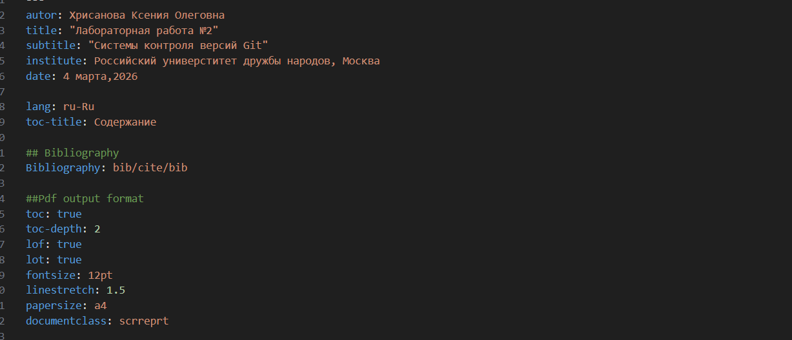
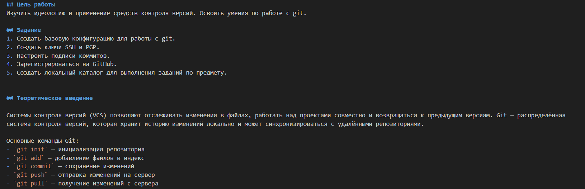
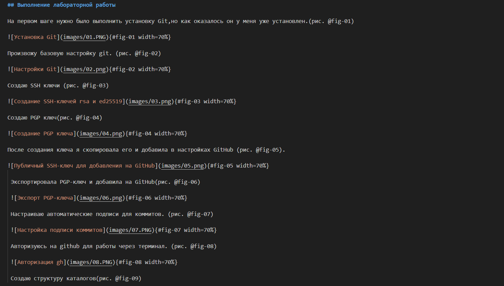
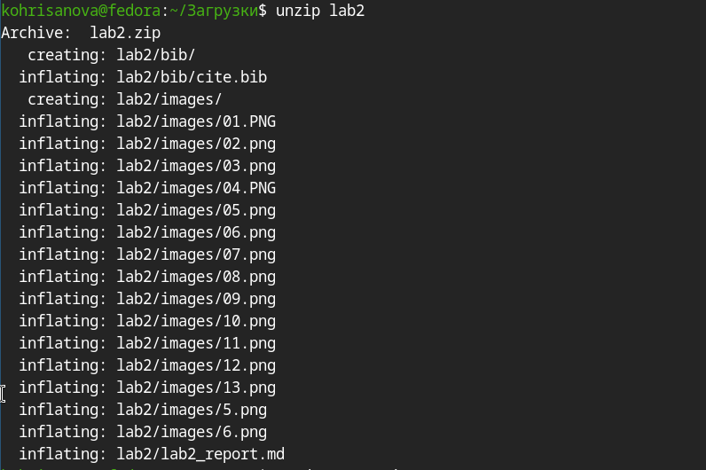
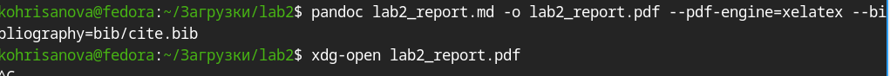
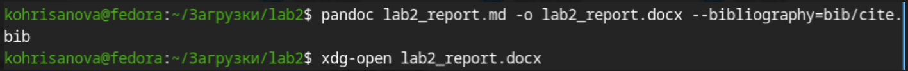

## Цель работы

Научиться оформлять отчёты с помощью легковесного языка разметки Markdown.

## Задание

1.Сделать отчёт по предыдущей лабораторной работе (№2) в формате Markdown.

2.В качестве отчёта предоставить файлы в 3 форматах: pdf, docx и md (в архиве, содержащем скриншоты, Makefile и т.д.)

## Теоретическое введение
Чтобы создать заголовок, используйте знак ( # ). Чтобы задать для текста полужирное начертание, заключите его в двойные звездочки. Чтобы задать для текста курсивное начертание, заключите его в одинарные звездочки. Чтобы задать для текста полужирное и курсивное начертание, заключите его в тройные звездочки. Блоки цитирования создаются с помощью символа >. Неупорядоченный (маркированный) список можно отформатировать с помощью звездочек или тире. Чтобы вложить один список в другой, добавьте отступ для элементов дочернего списка. Упорядоченный список можно отформатировать с помощью соответствующих цифр. Чтобы вложить один список в другой, добавьте отступ для элементов дочернего списка. Синтаксис Markdown для встроенной ссылки состоит из части [link text] , представляющей текст гиперссылки, и части (file-name.md) – URL-адреса или имени файла, на который дается ссылка. Markdown поддерживает как встраивание фрагментов кода в предложение, так и их размещение между предложениями в виде отдельных огражденных блоков. Огражденные блоки кода — это простой способ выделить синтаксис для фрагментов кода. Внутритекстовые формулы делаются аналогично формулам LaTeX. Преобразовать файл README.md можно следующим образом:
1 Pandoc README.md -o README.pdf или так 1 pandoc README.md -o README.docx Можно использовать следующий Makefile 1 FILES = (patsubst(wildcard *.md)) 2 FILES += 
(patsubst(wildcard *.md))

## Выполнение лабораторной работы

###  Настройка основной информации.

{#fig-01 width=50%}

## Оформиление цели работы, задания и теоретического введения

{#fig-02 width=50%}

## Описалние всех шагов выполнения:

{#fig-03 width=50%}

## Kонвертация отчёта в формат DOCX и PDF.

{#fig-04 width=50%}
{#fig-05 width=50%}
{#fig-06 width=50%}

## Вывод

В ходе выполнения данной лабораторной работы я научилась оформлять отчёты с помощью легковесного языка разметки Markdown.

