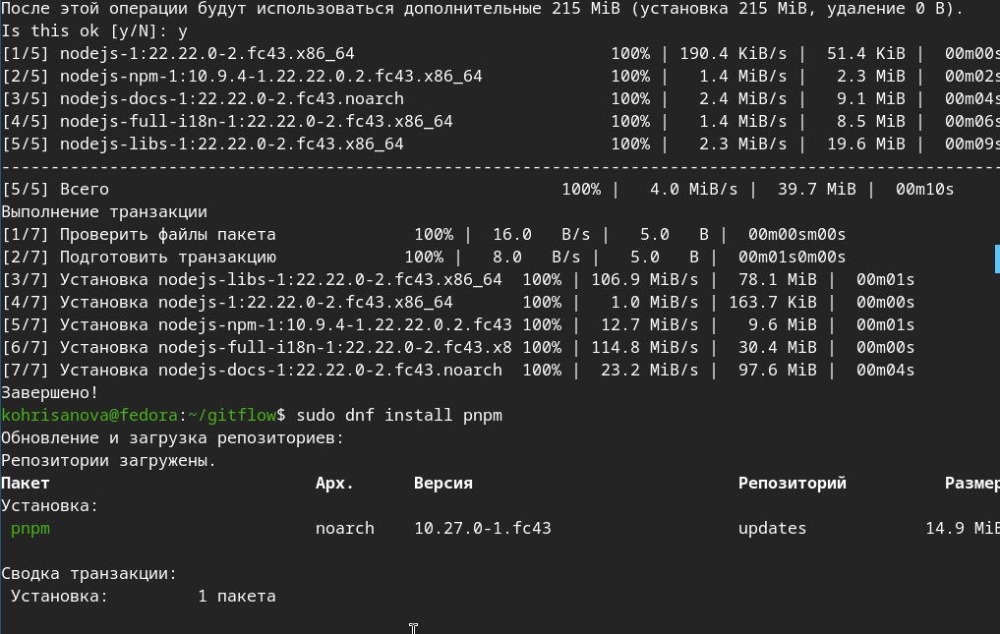
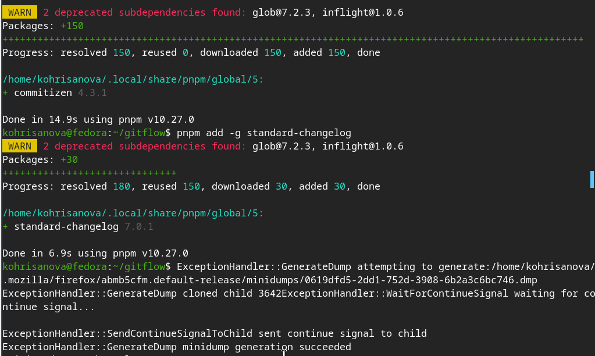
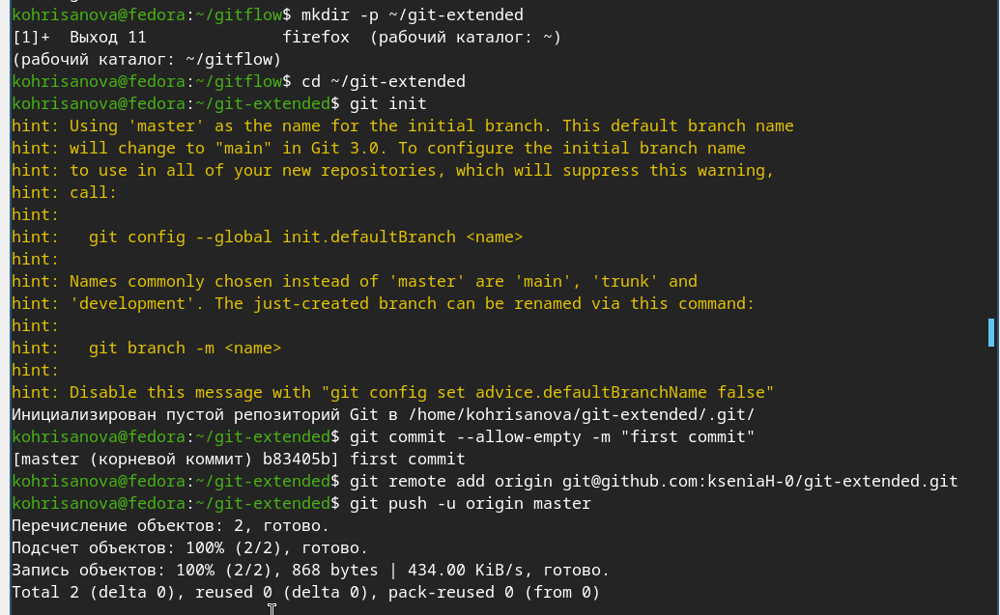
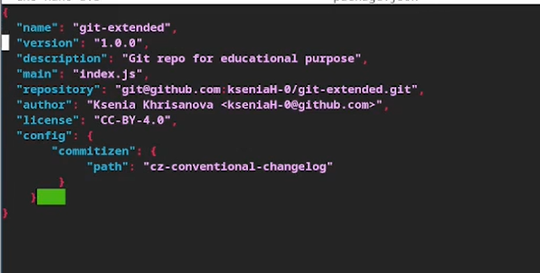
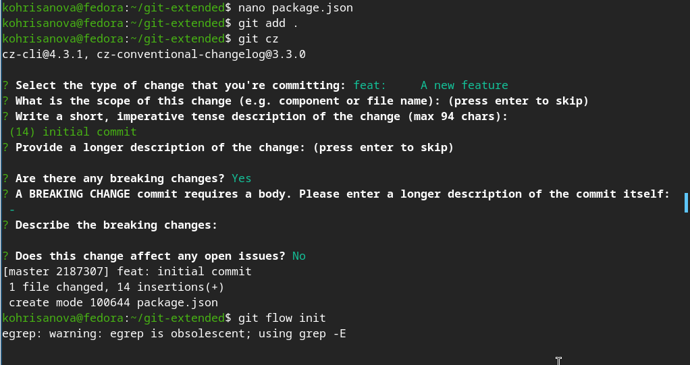
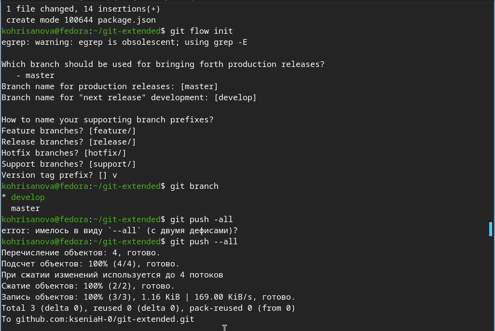
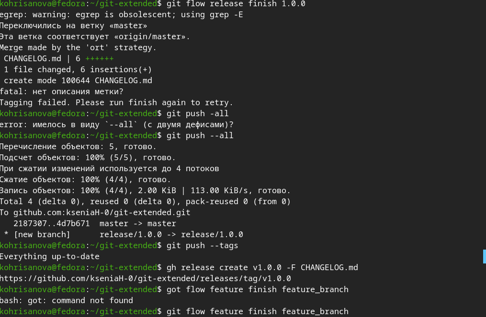
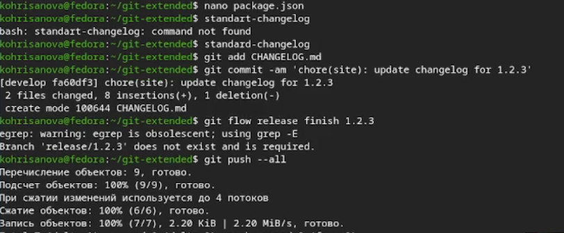

## Цель работы

Получение навыков продвинутой работы с репозиториями git и релизами.

##  Задание

1. Выполнить работу для тестового репозитория.
2. Преобразовать рабочий репозиторий в репозиторий с git-flow и conventional commits.

## Выполнение лабораторной работы

### Устанавливаю nodejs, пакетный менеджер для него pnpm и gitflow.

{#fig-01 widht=70%}

## Устаналиваю через pnpm commitizen и standard-changelog. 

{#fig-02 width=70%}

## Создаю новый репозиторий и делаю там первый коммит.

{#fig-03 width=70%}

## Инициализирую и конфигурирую общепринятые коммиты в созданной директории через редактирование package.json. 

{#fig-08 width=70%}

## Делаю снимок измененний, создаю коммит и отправляю на удаленный репозиторий. 

{#fig-04 width=70%}

## Инициализирую в репозитории git flow и создаю 1 релиз в только что созданной ветке develop.

{#fig-05 width=70%}

## Создаю список изменений через standard changelog, заканчиваю релиз и выгружаю на удаленный репозиторий изменения.

{#fig-06 width=70%}

## Инициализирую ветку feature для работы над новой функциональностью, готовлю релиз и загружаю на github.

{#fig-07 width=70%}

## Выводы

В ходе работы освоена работа с Gitflow, семантическим версионированием и Conventional Commits. Созданы feature-ветки, релизы и сгенерирован changelog. Полученные навыки позволяют вести структурированную разработку и автоматизировать выпуск версий проекта.

