## Цель работы

Познакомиться с pass, gopass, native messaging, chezmoi. Научиться пользоваться этими утилитами, синхронизировать их с гит.

## Задание

1. Установить дополнительное ПО
2. Установить и настроить pass
3. Настроить интерфейс с браузером
4. Сохранить пароль
5. Установить и настроить chezmoi
6. Настроить chezmoi на новой машине
7. Выполнить ежедневные операции с chezmoi

## Теоретическое введение

Менеджер паролей pass — программа, сделанная в рамках идеологии Unix. Также носит название стандартного менеджера паролей для Unix (The standard Unix password manager).
1.1 Основные свойства
    Данные хранятся в файловой системе в виде каталогов и файлов.
    Файлы шифруются с помощью GPG-ключа.
1.2 Структура базы паролей
    Структура базы может быть произвольной, если Вы собираетесь использовать её напрямую, без промежуточного программного обеспечения. Тогда семантику структуры базы данных Вы держите в своей голове.
    Если же необходимо использовать дополнительное программное обеспечение, необходимо семантику заложить в структуру базы паролей.
chezmoi используется для управления файлами конфигурации домашнего каталога пользователя. 
Конфигурация chezmoi
    2.2.1 Рабочие файлы
    Состояние файлов конфигурации сохраняется в каталоге ~/.local/share/chezmoi. Он является клоном вашего репозитория dotfiles.
    Файл конфигурации ~/.config/chezmoi/chezmoi.toml (можно использовать также JSON или YAML) специфичен для локальной машины.
    Файлы, содержимое которых одинаково на всех ваших машинах, дословно копируются из исходного каталога.
    Файлы, которые варьируются от машины к машине, выполняются как шаблоны, обычно с использованием данных из файла конфигурации локальной машины для настройки конечного содержимого, специфичного для локальной машины.

## Выполнение лабораторной работы

### Установка pass и pass-otp
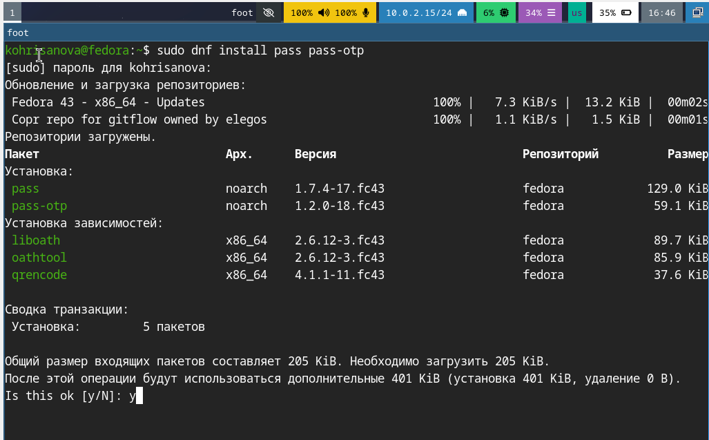{#fig-01 width=70%}

## Проверка GPG-ключа
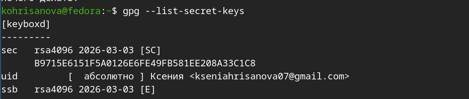{#fig-02 width=70%}

## Инициализация хранилища
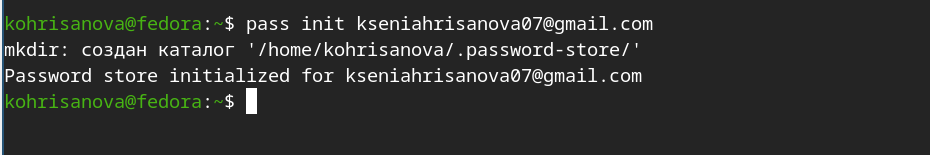{#fig-03 width=70%}

## Создание локального Git-репозитория
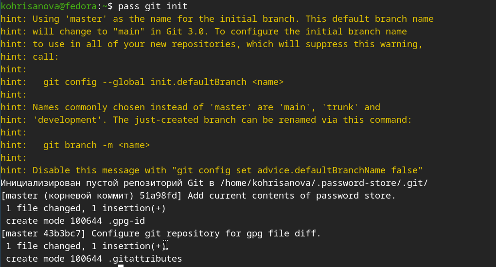{#fig-04 width=70%}

## Подключение удалённого репозитория

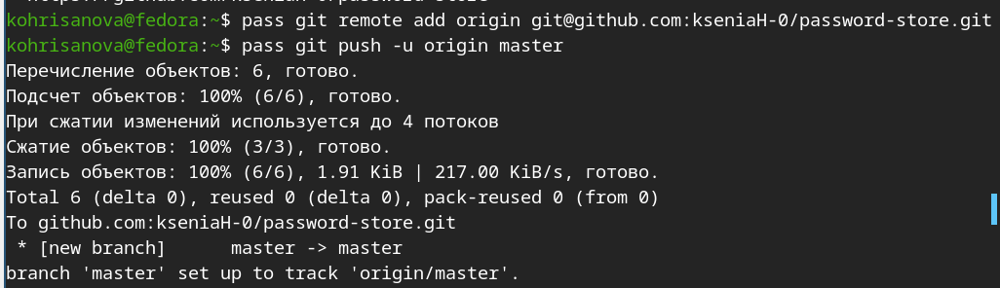{#fig-05 width=70%}

## Синхронизация изменений с сервером

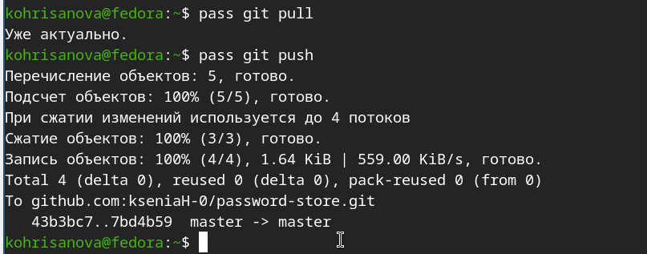{#fig-06 width=70%}

## Интеграция с браузером (browserpass)

### Установка native-клиента

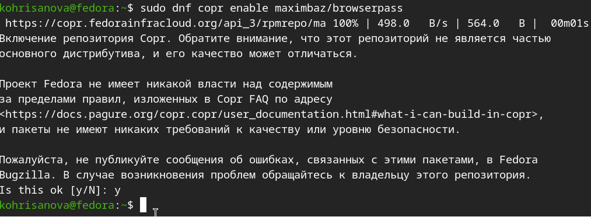{#fig-07 width=70%}
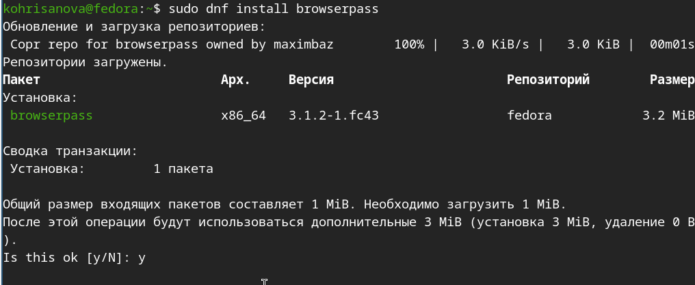{#fig-08 width=70%}

## Управление файлами конфигурации с chezmoi

### Установка дополнительных пакетов

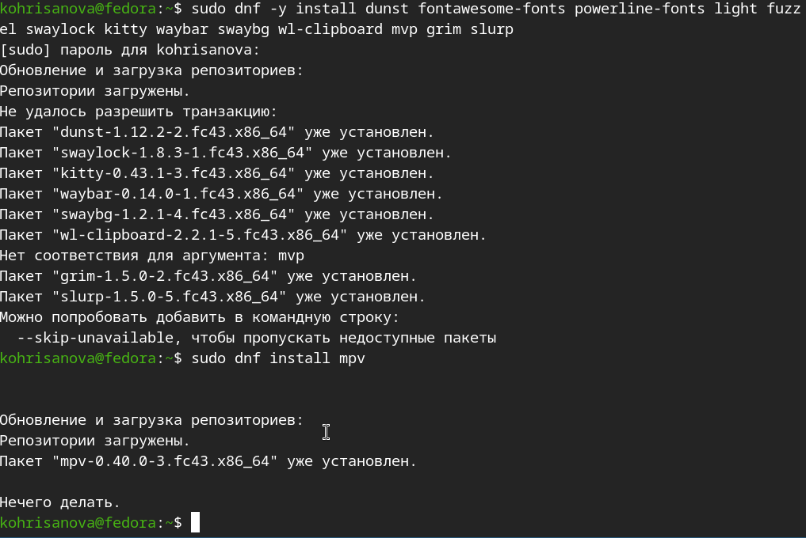{#fig-09 width=70%}

## Установка шрифтов Iosevka

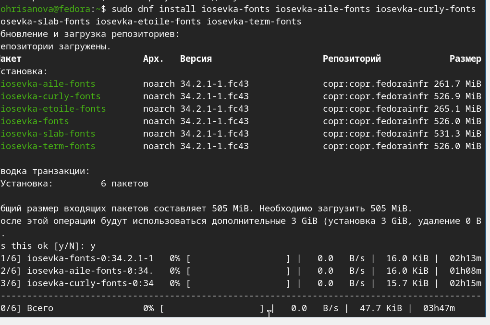{#fig-10 width=70%}

## Установка chezmoi

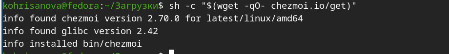{#fig-11 width=70%}

## Создание репозитория для dotfiles и инициализация

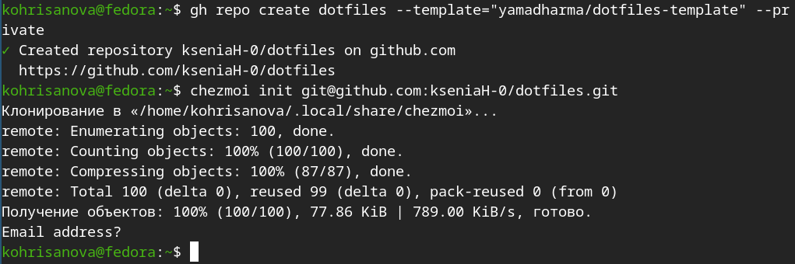{#fig-12 width=70%}

## Обновление конфигурации

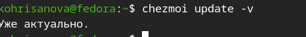{#fig-13 width=70%}

## Настройка автоcommit и autopush

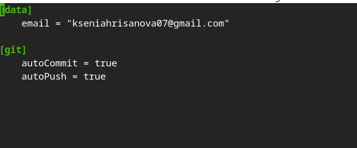{#fig-14 width=70%}

## Выводы

Мы познакомились с pass, gopass, native messaging, chezmoi. Научились пользоваться этими утилитами, синхронизировали их с гит.

