## Цель работы
Приобретение практических навыков взаимодействия пользователя с системой посредством командной строки.

## Задание
- Определить полное имя домашнего каталога.
- Перейти в каталог /tmp и вывести его содержимое с разными опциями.
- Проверить наличие подкаталога cron в /var/spool.
- Вернуться в домашний каталог и определить владельцев файлов.
- Создать и удалить каталоги с разными опциями.
- Изучить опции команд ls, cd, pwd, mkdir, rmdir, rm через man.
- Поработать с историей команд.

## Ход выполнения работы

###  Определение полного имени домашнего каталога (рис. @fig-01)

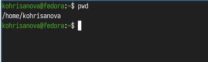{#fig-01 width=70%}
 
### Переход в каталог /tmp и просмотр содержимого  (рис. @fig-02.1)  (рис. @fig-02.2)

- Вывод содержимого без опций
- Вывод с опцией -l (подробная информация)
- Вывод с опцией -a (включая скрытые файлы)
- Вывод с опцией -F (указание типа файлов)

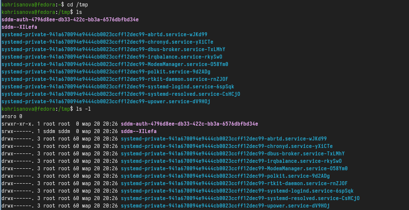{#fig-02.1 width=70%}

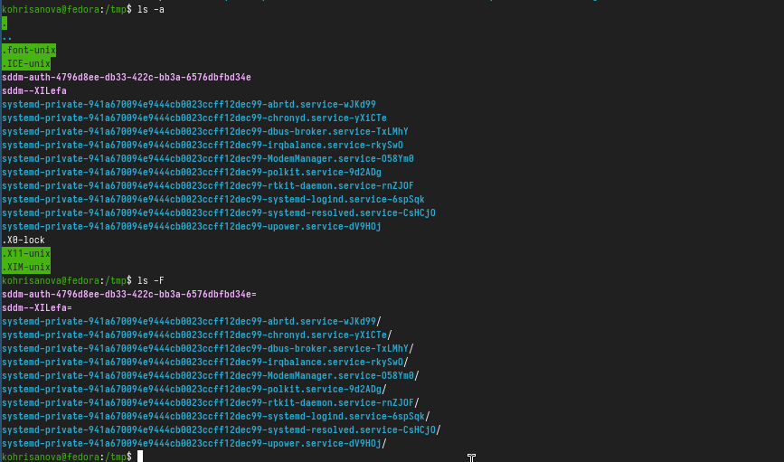{#fig-02.2  width=70%}

### Поиск подкаталога cron в /var/spool(рис. @fig-03)

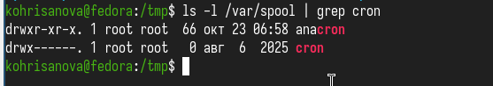{#fig-03 width=70%}

Вывод: подкаталог cron существует в /var/spool.

### Возврат в домашний каталог и определение владельцев(рис. @fig-04)

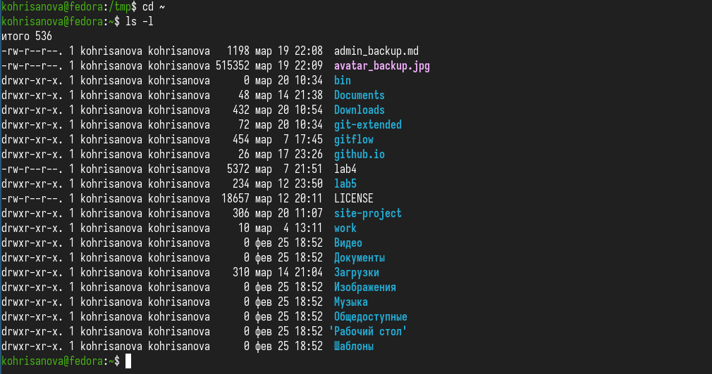{#fig-04 width=70%}

Вывод: владельцем всех файлов и подкаталогов является пользователь kohrisanova.

### Создание и удаление каталогов(рис. @fig-05)

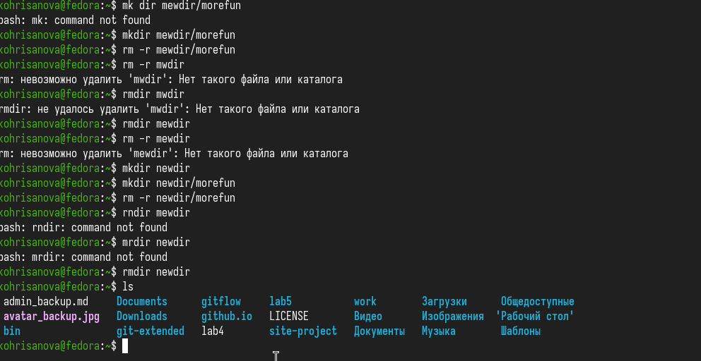{#fig-05 width=70%}

### Изучение опций команды ls через man(рис. @fig-06)

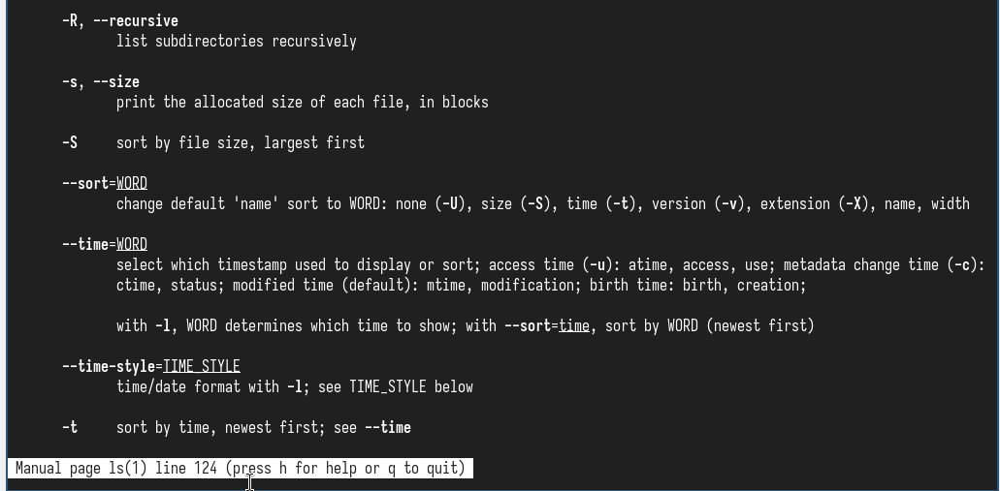{#fig-06 width=70%}

### Просмотр описания команд

- Команда cd(рис. @fig-07)

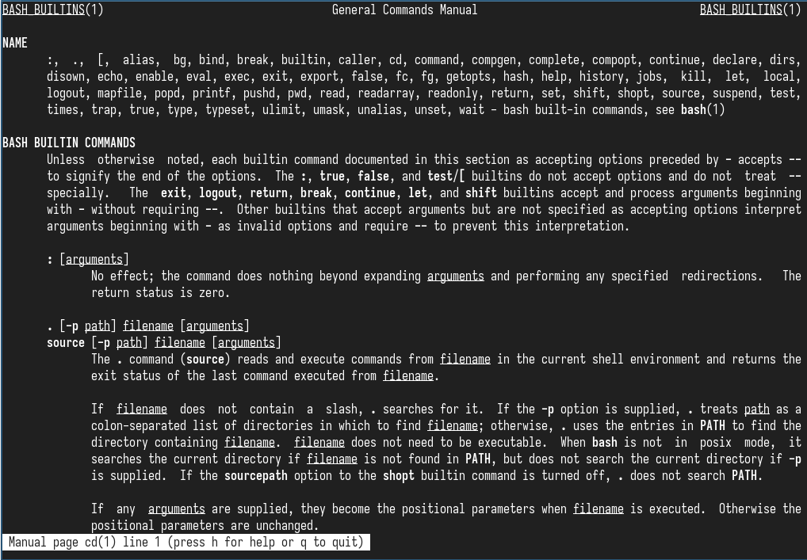{#fig-07 width=70%}

Основные опции: cd — смена текущего каталога, опций не имеет.

- Команда pwd(рис. @fig-08)

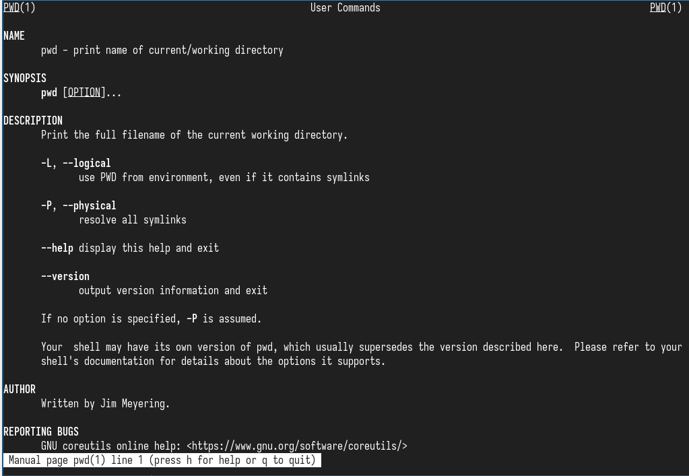{#fig-08 width=70%}

Основные опции: -L (логический путь), -P (физический путь, без символьных ссылок).

- Команда mkdir(рис. @fig-09)

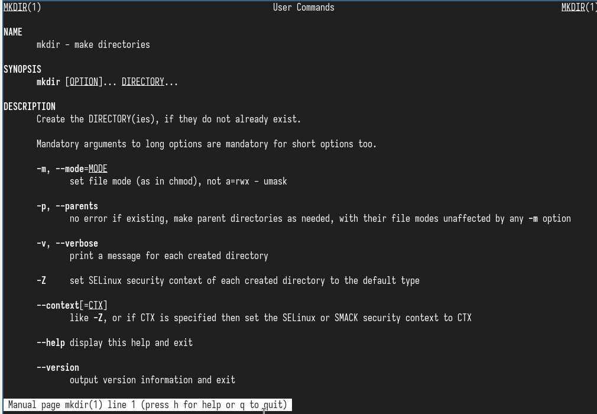{#fig-09 width=70%}

Основные опции: -m (установка прав доступа), -p (создание родительских каталогов), -v (вывод сообщений).

- Команда rmdir(рис. @fig-10)

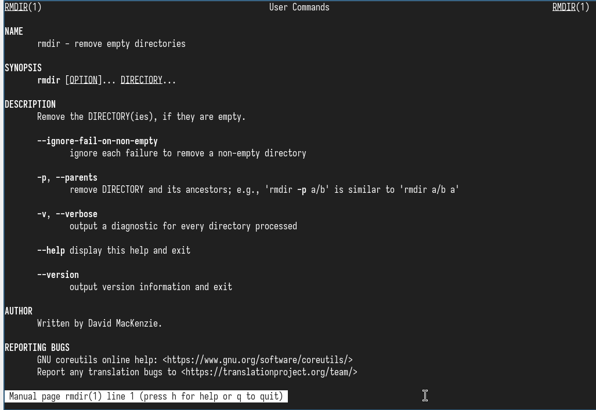{#fig-10 width=70%}

Основные опции: -p (удаление родительских пустых каталогов), --ignore-fail-on-non-empty (игнорировать ошибки).

- Команда rm(рис. @fig-11)

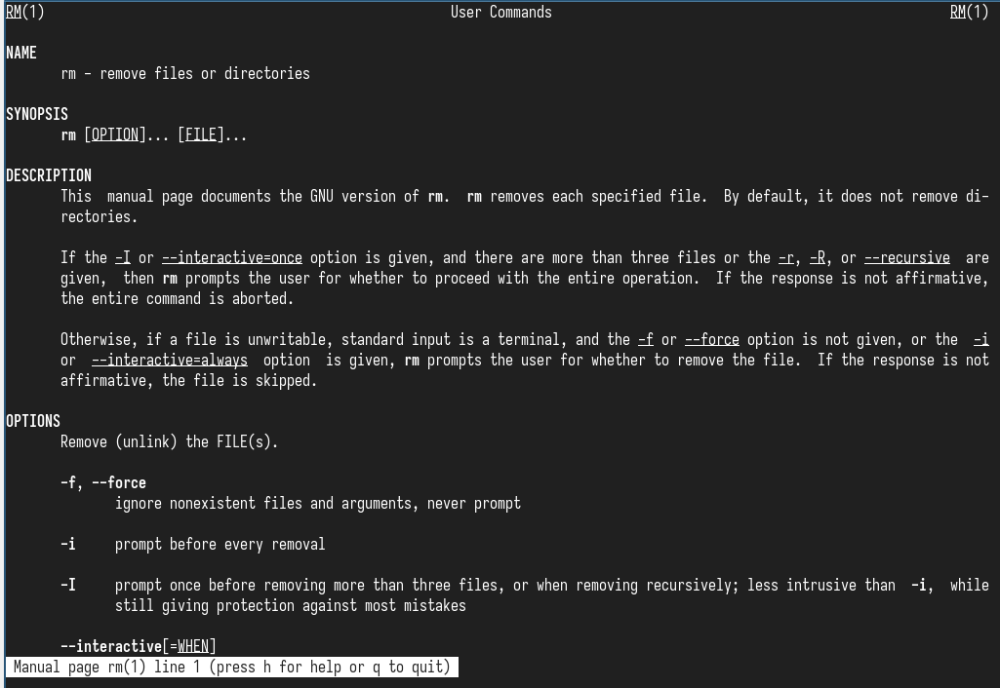{#fig-11 width=70%}

Основные опции: -r (рекурсивное удаление), -f (без подтверждения), -i (с подтверждением).

### Работа с историей команд

- Просмотр истории команд(рис. @fig-12)

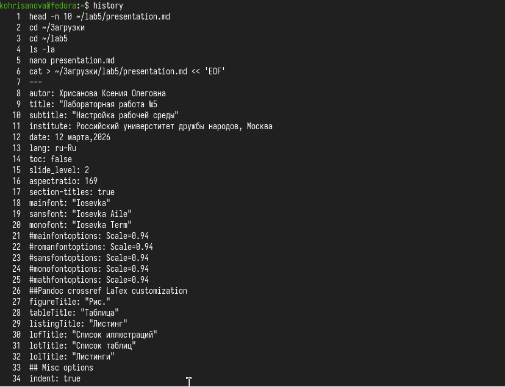{#fig-12 width=70%}

- Повторное выполнение команды по номеру(рис. @fig-13)

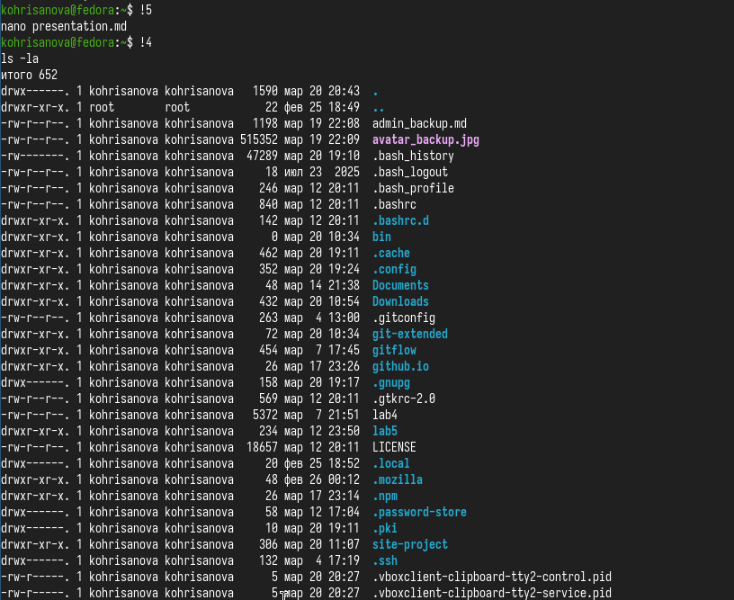{#fig-13 width=70%}

- Модификация команды из истории(рис. @fig-14)

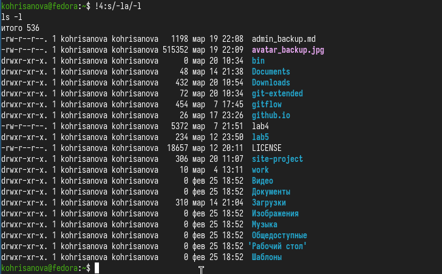{#fig-14 width=70%}

##  Выводы

В ходе выполнения лабораторной работы были приобретены следующие навыки:

Определение текущего каталога с помощью pwd и навигация по файловой системе с cd.

Просмотр содержимого каталогов с использованием различных опций команды ls (-l, -a, -F, -R, -t).

Поиск файлов и каталогов с помощью grep.

Создание и удаление каталогов с помощью mkdir, rmdir, rm -r.

Изучение справочной информации о командах с помощью man.

Работа с историей команд (history, !, :s).

Полученные навыки являются основой для дальнейшей работы в командной среде Unix-подобных систем.

Работа выполнена в соответствии с методическими указаниями [@lab6].

##  Список литературы{.unnumbered}
::: {#refs}
:::

##  Ответы на контрольные вопросы
1. Что такое командная строка?
Командная строка — это интерфейс взаимодействия пользователя с операционной системой, в котором команды вводятся в виде текстовых строк.

2. При помощи какой команды можно определить абсолютный путь текущего каталога? Приведите пример.
pwd
Пример: pwd → /home/kohrisanova

3. При помощи какой команды и каких опций можно определить только тип файлов и их имена в текущем каталоге? Приведите примеры.
ls -F
Пример: ls -F → dir/ file.txt* link@

4. Каким образом отобразить информацию о скрытых файлах? Приведите примеры.
ls -a
Пример: ls -a → . .bashrc .config

5. При помощи каких команд можно удалить файл и каталог? Можно ли это сделать одной и той же командой? Приведите примеры.

Файл: rm file.txt

Каталог: rm -r dir или rmdir dir (если пустой)
Одной командой rm -r можно удалить и файлы, и каталоги.

6. Каким образом можно вывести информацию о последних выполненных пользователем командах?
history

7. Как воспользоваться историей команд для их модифицированного выполнения? Приведите примеры.
!номер_команды:s/старое/новое/
Пример: !4:s/-la/-l

8. Приведите примеры запуска нескольких команд в одной строке.
mkdir dir; cd dir; pwd или mkdir dir && cd dir && pwd

9. Дайте определение и приведите примера символов экранирования.
Символ \ отменяет специальное значение следующего символа.
Пример: echo \$PATH выведет $PATH, а не его значение.

10. Охарактеризуйте вывод информации на экран после выполнения команды ls с опцией l.
Вывод содержит: тип файла и права доступа (drwxr-xr-x), количество ссылок, владельца, группу, размер, дату последней модификации и имя файла.

11. Что такое относительный путь к файлу? Приведите примеры использования относительного и абсолютного пути при выполнении какой-либо команды.

Абсолютный — от корня /: /home/kohrisanova/file.txt

Относительный — от текущего каталога: ../work/file.txt
Пример: cd /home (абсолютный), cd ~/work (относительный)

12. Как получить информацию об интересующей вас команде?
man команда
Пример: man ls

13. Какая клавиша или комбинация клавиш служит для автоматического дополнения вводимых команд?
Tab (табуляция)

