##  Цель работы

Ознакомление с файловой системой Linux, её структурой, именами и содержанием каталогов. Приобретение практических навыков по применению команд для работы с файлами и каталогами, по управлению процессами, по проверке использования диска и обслуживанию файловой системы.

## Выполнение лабораторной работы

### Выполним примеры, приведённые в первой части описания лабораторной работы. 

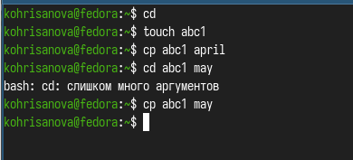{ #fig:001 width=70% }

##  
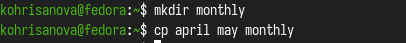{ #fig:002 width=70% }

## 
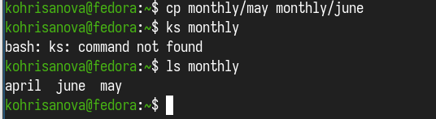{ #fig:003 width=70% }

##  
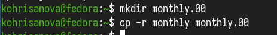{ #fig:004 width=70% }

## 
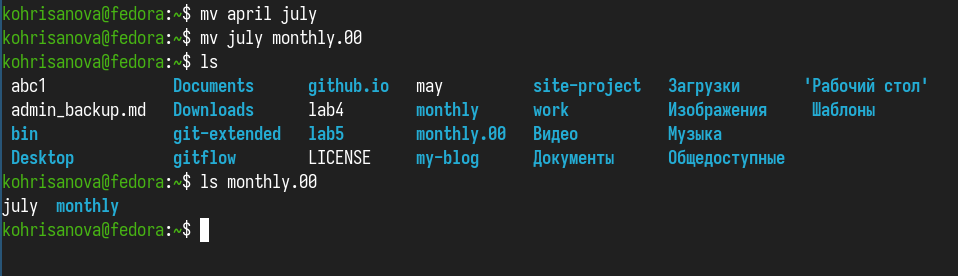{ #fig:005 width=70% }

## 
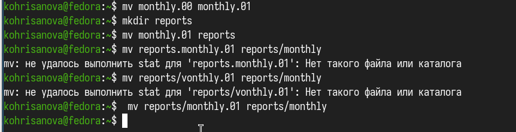{ #fig:006 width=70% }

## 
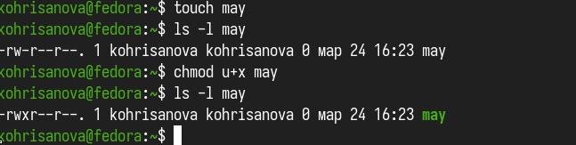{ #fig:007 width=70% }

## 
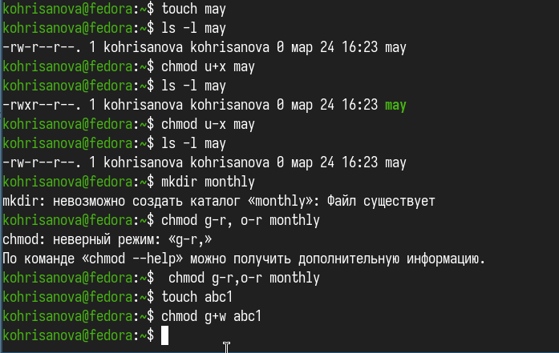{ #fig:008 width=70% }

## 
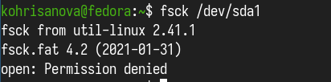{ #fig:009 width=70% }

##  В домашнем каталоге создаем директорию ski.plases,перемещаем в него файл. Переименовываем файл. После этого создаем в домашнем каталоге файл abc1 и копируем его в каталог ski.plases и переименовываем в equiplist2. Создаем каталог с именем equipment в каталоге ski.plases. Перемещаем файлы equiplist и equiplist2 в каталог equipment. Создаем и перемещаем каталог newdir в каталог ski.plases и называем его plans.

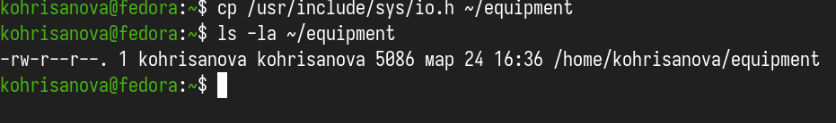{ #fig:010 width=70% }

## 
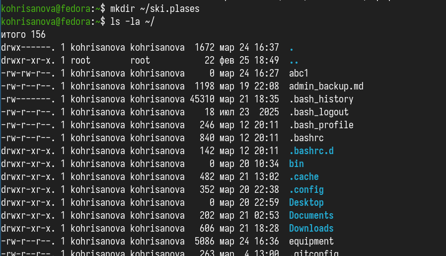{ #fig:011 width=70% }

## 
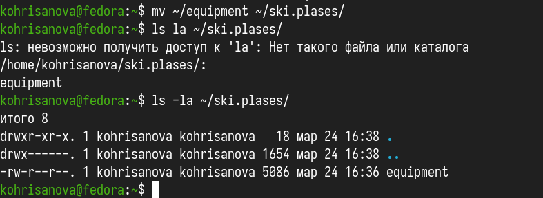{ #fig:012 width=70% }

## 
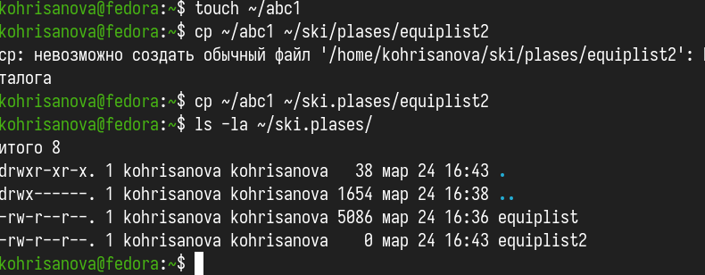{ #fig:014 width=70% }

## 
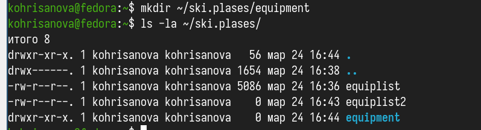{ #fig:015 width=70% }

## 
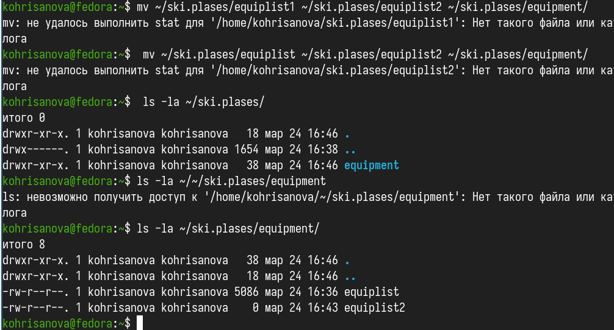{ #fig:016 width=70% }

## Определим опции команды chmod, необходимые для того, чтобы присвоить файлам из хода работы нужные права доступа.

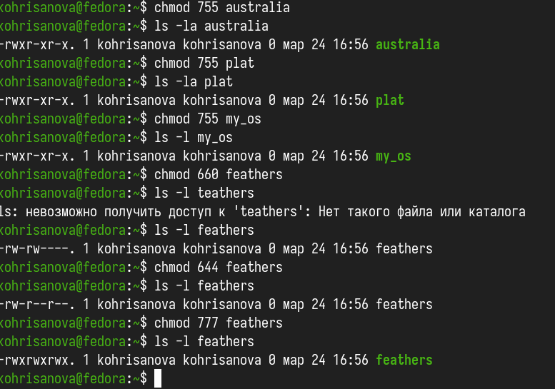{ #fig:018 width=70% }

## Просмотрим содержимое файла /etc/passwd.

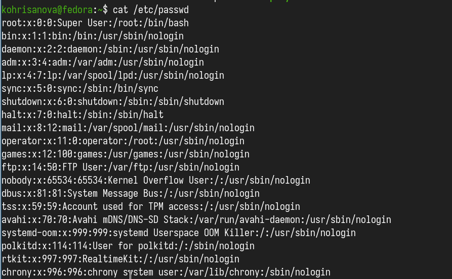{ #fig:019 width=70% }

## Выполним все указанные действия по перемещению файлов и каталогов 

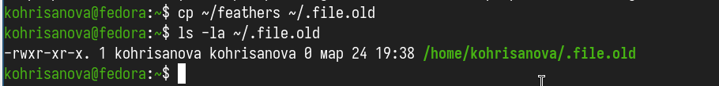{ #fig:020 width=70% }

##  
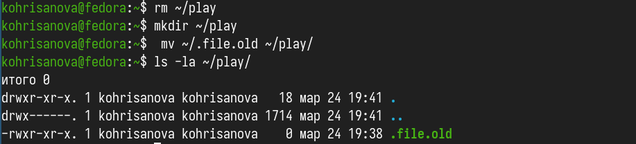{ #fig:021 width=70% }

## 
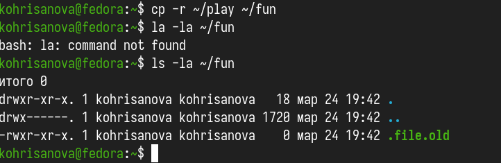{ #fig:022 width=70% }

## 
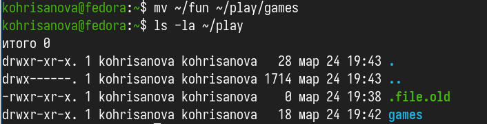{ #fig:023 width=70% }

## 
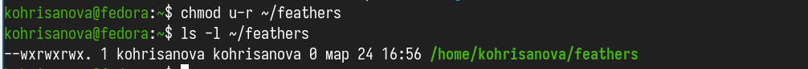{ #fig:024 width=70% }

## Если мы попытаемся просмотреть файл feathers командой cat или спироват его то нам будет отказано в доступе.

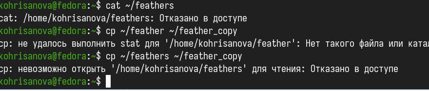{ #fig:025 width=70% }

## Прочитаем man по командам mount, fsck, mkfs, kill и кратко их охарактеризуем, приведя примеры.

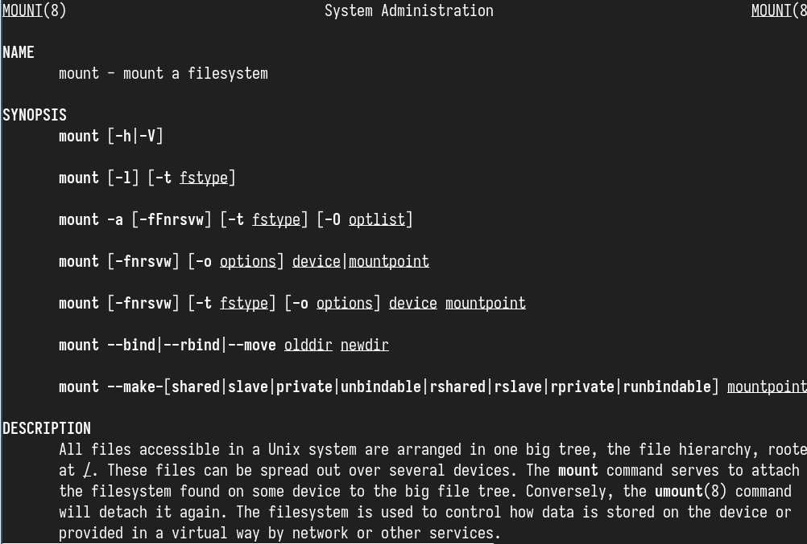{ #fig:029 width=70% }

## Монтирование файловой системы к общему дереву каталогов. Для размонтирования используется команда unmonnt.

### fsck
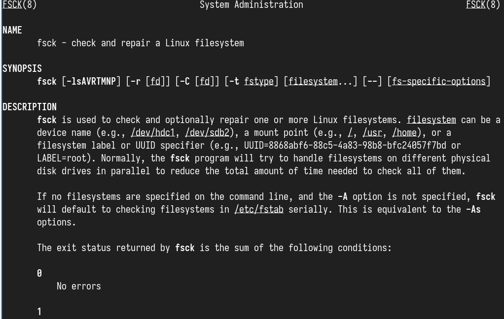{ #fig:030 width=70% }

## mkfs
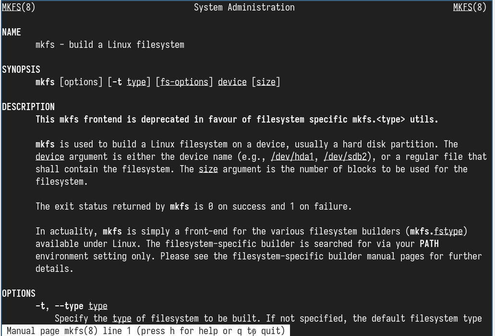{ #fig:031 width=70% }

## kill
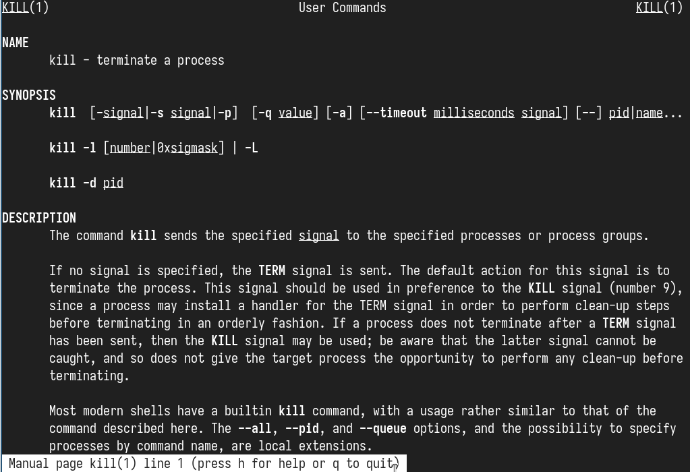{ #fig:032 width=70% }

## Вывод

В ходе данной работы мы ознакомились с файловой системой Linux, её структурой, именами и содержанием каталогов. Научились совершать базовые операции с файлами, управлять правами их доступа для пользователя и групп. Ознакомились с Анализом файловой системы. А также получили базовые навыки по проверке использования диска и обслуживанию файловой системы.
