## Цель работы

Ознакомление с инструментами поиска файлов и фильтрации текстовых данных. Приобретение практических навыков: по управлению процессами, по проверке  использования диска и обслуживанию файловых систем.

## Выполнение лабораторной работы

### Запишем в файл file.txt названия файлов, содержащихся в каталоге /etc. Допишем в этот же файл названия файлов, содержащихся в нашем домашнем каталоге. 
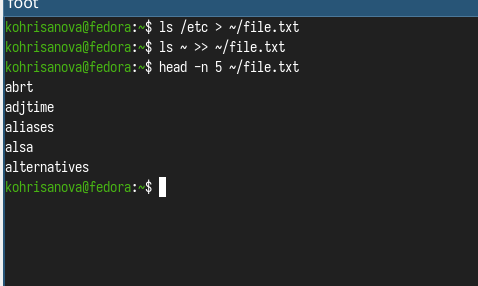{ #fig:001 height=70% width=70% }

## Выведем имена всех файлов из file.txt, имеющих расширение .conf, после чего запишем их в новый текстовой файл conf.txt. 

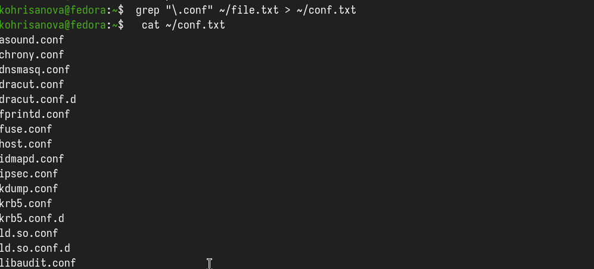{ #fig:002 height=70% width=70% }

## Определили, какие файлы в нашем домашнем каталоге имеют имена, начинавшиеся с символа c? 

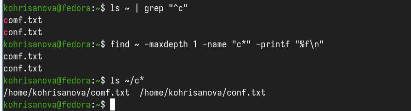{ #fig:003 height=70% width=70% }

## Выведем на экран (постранично) имена файлов из каталога /etc, начинающиеся с символа h.
```
find /etc -name "h*" -print | less 
```
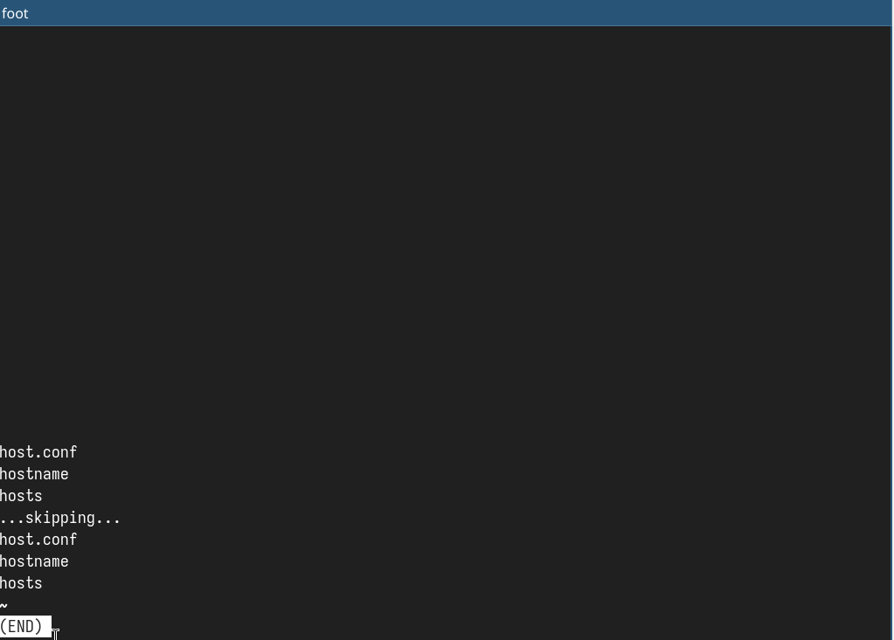{ #fig:004 height=70% width=70% }

## Запустили в фоновом режиме процесс, который будет записывать в файл ~/logfile файлы, имена которых начинаются с log. 
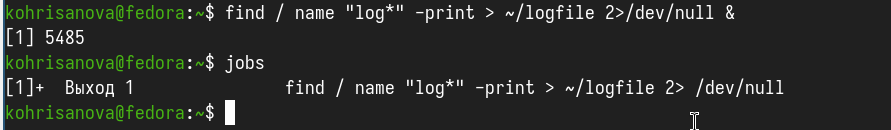{ #fig:005 height=70% width=70% }

## удалили файл ~/logfile. Но сначала убили процесс в нем.

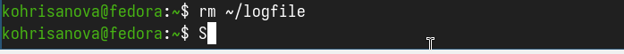{ #fig:006 height=70% width=70% } 

## Запустили из консоли в фоновом режиме редактор gedit. 

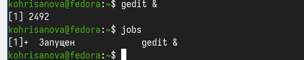{ #fig:007 height=70% width=70% }

## Определили идентификатор процесса gedit, используя команду ps, конвейер и фильтр grep

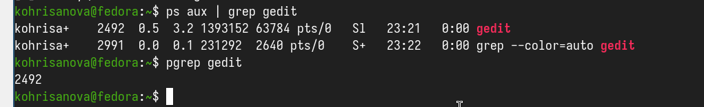{ #fig:008 height=70% width=70% }

## Прочитали справку (man) команды kill
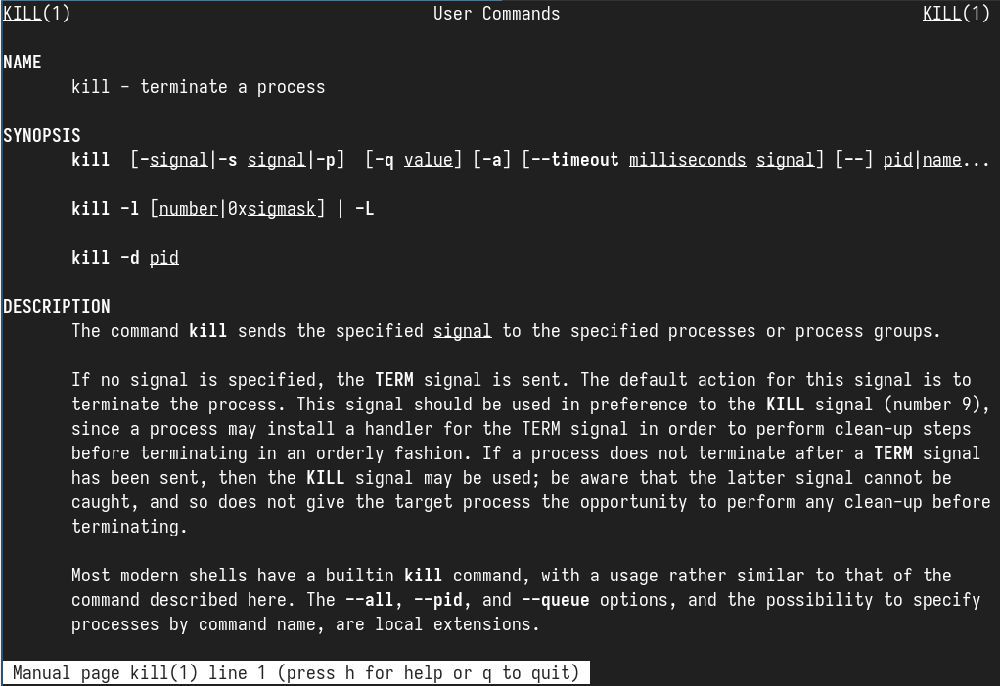{ #fig:009 height=70% width=70% }

##  После чего использовали её для завершения процесса gedit. 

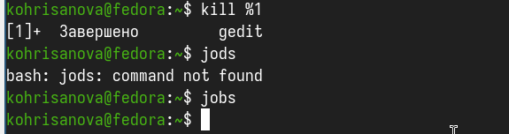{ #fig:010 height=70% width=70% }

## Выполним команды df и du, предварительно получив более подробную информацию об этих командах, с помощью команды man. 

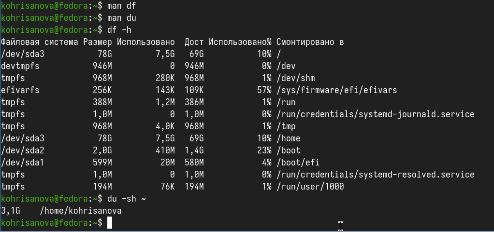{ #fig:011 height=70% width=70% }


## Вывод

В данной работе мы ознакомились с инструментами поиска файлов и фильтрации текстовых данных. А также приобрели практические навыки по управлению процессами.

